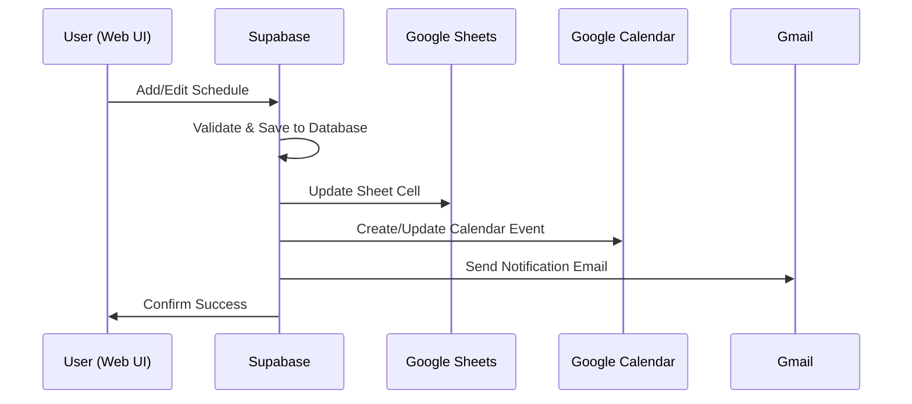
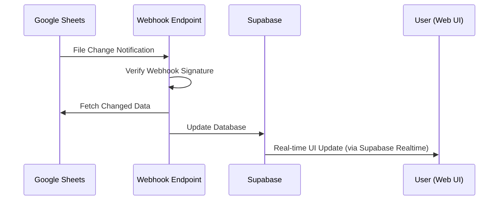

# Google Workspace Integration - Data Flow Architecture
**Phase 1.3: Data Flow Design between Supabase ↔ Google Sheets**

## 🎯 Overview
Comprehensive data flow architecture for bi-directional synchronization between Supabase database and Google Workspace (Sheets, Calendar, Gmail).

## 📊 Core Data Flow Patterns

### Pattern 1: User Action → Supabase → Google Workspace


### Pattern 2: Google Sheets → Webhook → Supabase


## 🏗️ Architecture Components

### 1. Database Layer (Supabase)
```javascript
// Core Tables for Google Integration
const supabaseSchema = {
  google_workspace_courses: {
    purpose: "Course definitions with Google integration metadata",
    keyFields: ["name", "company", "sheet_template_id", "calendar_color_id"]
  },
  
  google_workspace_instructors: {
    purpose: "Instructor profiles with Google Calendar/Gmail integration",
    keyFields: ["name", "email", "google_calendar_id", "notification_email"]
  },
  
  google_schedule_sheets: {
    purpose: "Registry of Google Sheets for weekly schedules",
    keyFields: ["sheet_id", "sheet_url", "company", "week_start_date", "webhook_id"]
  },
  
  google_sheets_sync_log: {
    purpose: "Audit trail of all sync operations",
    keyFields: ["operation", "sync_direction", "status", "data_before", "data_after"]
  },
  
  google_calendar_events: {
    purpose: "Track Google Calendar events created from schedules",
    keyFields: ["google_event_id", "sheet_id", "schedule_cell", "start_datetime"]
  },
  
  google_email_logs: {
    purpose: "Log all Gmail notifications sent to instructors",
    keyFields: ["gmail_message_id", "email_type", "to_emails", "send_status"]
  }
};
```

### 2. Service Layer
```javascript
// Google Workspace Services Architecture
const serviceLayer = {
  googleSheetsService: {
    responsibilities: [
      "Create/update spreadsheets",
      "Batch cell updates",
      "Template management",
      "Webhook setup"
    ],
    keyMethods: [
      "createScheduleSpreadsheet()",
      "updateScheduleCell()",
      "batchUpdateSchedule()",
      "setupWebhook()"
    ]
  },
  
  googleCalendarService: {
    responsibilities: [
      "Create calendar events",
      "Send invitations",
      "Handle recurring events",
      "Manage attendees"
    ],
    keyMethods: [
      "createTeachingEvent()",
      "updateEvent()",
      "cancelEvent()",
      "addAttendees()"
    ]
  },
  
  gmailService: {
    responsibilities: [
      "Send notifications",
      "Template rendering",
      "Delivery tracking",
      "Bounce handling"
    ],
    keyMethods: [
      "sendTeacherNotification()",
      "renderTemplate()",
      "trackDelivery()",
      "handleBounce()"
    ]
  }
};
```

### 3. Real-time Synchronization Layer
```javascript
const realtimeSync = {
  supabaseRealtime: {
    purpose: "Push database changes to web UI",
    channels: [
      "google_schedule_sheets",
      "google_calendar_events", 
      "google_sheets_sync_log"
    ],
    events: ["INSERT", "UPDATE", "DELETE"]
  },
  
  googleWebhooks: {
    purpose: "Push Google Sheets changes to our system",
    endpoint: "/api/google-sheets-webhook",
    security: "Token-based verification",
    processing: "Async job queue"
  }
};
```

## 🔄 Detailed Data Flow Scenarios

### Scenario 1: Create New Weekly Schedule
```javascript
// User creates new schedule for week
const createWeeklyScheduleFlow = {
  step1: {
    action: "User clicks 'Create Schedule for Week 2025-01-13'",
    location: "GoogleWorkspaceSchedulePage.jsx"
  },
  
  step2: {
    action: "Frontend calls createWeeklyGoogleSheet(company, weekStartDate)",
    service: "useGoogleSheetsSchedule hook"
  },
  
  step3: {
    action: "Backend creates Google Sheet from template",
    service: "googleSheetsService.createScheduleSpreadsheet()",
    googleAPI: "sheets.spreadsheets.create()"
  },
  
  step4: {
    action: "Setup webhook for real-time updates",
    service: "googleSheetsService.setupWebhook()",
    googleAPI: "drive.files.watch()"
  },
  
  step5: {
    action: "Save sheet metadata to database",
    database: "INSERT INTO google_schedule_sheets"
  },
  
  step6: {
    action: "Return sheet URL to frontend",
    result: "User sees embedded Google Sheet"
  }
};
```

### Scenario 2: Add Course to Schedule
```javascript
// User drags course to time slot
const addCourseToScheduleFlow = {
  step1: {
    action: "User drags 'วิศวกรรมคอมพิวเตอร์' to Monday 09:00",
    location: "Schedule grid component"
  },
  
  step2: {
    action: "Frontend calls addSchedule(dayIndex=0, timeIndex=1, courseData)",
    service: "useGoogleSheetsSchedule hook"
  },
  
  step3: {
    action: "Update database with optimistic UI",
    database: "Local state update + Supabase insert"
  },
  
  step4: {
    action: "Sync to Google Sheets",
    service: "googleSheetsService.updateScheduleCell()",
    googleAPI: "sheets.spreadsheets.values.update()",
    cellRange: "B3", // Monday 09:00 cell
    cellValue: "วิศวกรรมคอมพิวเตอร์\nอาจารย์สมชาย\nห้อง A101"
  },
  
  step5: {
    action: "Create Google Calendar event",
    service: "googleCalendarService.createTeachingEvent()",
    googleAPI: "calendar.events.insert()",
    eventData: {
      summary: "วิศวกรรมคอมพิวเตอร์ - อาจารย์สมชาย",
      start: "2025-01-13T09:00:00+07:00",
      end: "2025-01-13T10:30:00+07:00",
      location: "ห้อง A101",
      attendees: ["somchai@example.com"]
    }
  },
  
  step6: {
    action: "Send notification email",
    service: "gmailService.sendTeacherNotification()",
    googleAPI: "gmail.users.messages.send()",
    emailType: "schedule_created"
  },
  
  step7: {
    action: "Log all operations",
    database: [
      "INSERT INTO google_sheets_sync_log",
      "INSERT INTO google_calendar_events", 
      "INSERT INTO google_email_logs"
    ]
  }
};
```

### Scenario 3: Real-time Collaboration (Google Sheets → Supabase)
```javascript
// Another user edits directly in Google Sheets
const realtimeCollaborationFlow = {
  step1: {
    action: "User B edits cell C4 in Google Sheets directly",
    trigger: "Google Drive file change"
  },
  
  step2: {
    action: "Google sends webhook notification",
    endpoint: "POST /api/google-sheets-webhook",
    payload: {
      resourceId: "sheet_123",
      resourceState: "update",
      eventTime: "2025-01-09T14:30:00Z"
    }
  },
  
  step3: {
    action: "Webhook handler verifies and processes",
    service: "webhookHandler.processSheetChange()",
    security: "Verify X-Goog-Channel-Token"
  },
  
  step4: {
    action: "Fetch changed data from Google Sheets",
    service: "googleSheetsService.getChangedCells()",
    googleAPI: "sheets.spreadsheets.values.get()",
    range: "C4" // Changed cell
  },
  
  step5: {
    action: "Update Supabase database",
    database: "UPDATE schedule based on cell position",
    logic: "Map cell C4 to dayIndex=1, timeIndex=3"
  },
  
  step6: {
    action: "Broadcast change to all connected users",
    service: "supabase.realtime.broadcast()",
    channel: "google_schedule_sheets:sheet_123"
  },
  
  step7: {
    action: "Update web UI for all users",
    frontend: "Real-time schedule grid update"
  }
};
```

## 📋 Data Mapping Standards

### Google Sheets Cell Mapping
```javascript
const cellMapping = {
  // Time slots (rows) - 8:00 to 21:00
  timeSlots: [
    { time: '08:00', row: 2 },
    { time: '09:00', row: 3 },
    { time: '10:00', row: 4 },
    // ... up to row 15 for 21:00
  ],
  
  // Days (columns)
  days: {
    'เวลา': 'A',      // Time column
    'จันทร์': 'B',     // Monday
    'อังคาร': 'C',     // Tuesday  
    'พุธ': 'D',        // Wednesday
    'พฤหัสบดี': 'E',   // Thursday
    'ศุกร์': 'F',      // Friday
    'เสาร์': 'G',      // Saturday
    'อาทิตย์': 'H'     // Sunday
  },
  
  // Cell reference function
  getCellReference: (dayIndex, timeIndex) => {
    const columns = ['A', 'B', 'C', 'D', 'E', 'F', 'G', 'H'];
    const row = timeIndex + 2; // Start from row 2
    return columns[dayIndex + 1] + row; // +1 to skip time column
  }
};
```

### Schedule Data Format
```javascript
const scheduleDataFormat = {
  supabaseFormat: {
    id: "uuid",
    course_id: "uuid", 
    instructor_id: "uuid",
    day_index: 0, // Monday = 0
    time_index: 1, // 09:00 = 1
    location: "ห้อง A101",
    company: "login"
  },
  
  googleSheetsFormat: {
    cellReference: "B3", // Monday 09:00
    cellValue: "วิศวกรรมคอมพิวเตอร์\nอาจารย์สมชาย\nห้อง A101",
    formatting: {
      backgroundColor: "#e3f2fd",
      textFormat: {
        bold: true,
        fontSize: 10
      }
    }
  },
  
  calendarEventFormat: {
    summary: "วิศวกรรมคอมพิวเตอร์ - อาจารย์สมชาย",
    description: "สถานที่: ห้อง A101\nบริษัท: Login Learning",
    start: { 
      dateTime: "2025-01-13T09:00:00+07:00",
      timeZone: "Asia/Bangkok"
    },
    end: {
      dateTime: "2025-01-13T10:30:00+07:00", 
      timeZone: "Asia/Bangkok"
    }
  }
};
```

## 🔧 Error Handling & Recovery

### Error Categories
```javascript
const errorHandling = {
  googleAPIErrors: {
    rateLimitExceeded: {
      httpCode: 429,
      strategy: "Exponential backoff",
      maxRetries: 3,
      fallback: "Queue for later processing"
    },
    
    permissionDenied: {
      httpCode: 403,
      strategy: "Check Service Account permissions",
      recovery: "Notify admin, use fallback operations"
    },
    
    resourceNotFound: {
      httpCode: 404,
      strategy: "Recreate resource if needed",
      recovery: "Create new sheet/event"
    }
  },
  
  syncConflicts: {
    simultaneousEdit: {
      detection: "Compare timestamp + user context",
      resolution: "Last-writer-wins with conflict notification"
    },
    
    dataInconsistency: {
      detection: "Hash comparison between sources",
      resolution: "Full resync with user confirmation"
    }
  },
  
  networkIssues: {
    webhookFailure: {
      detection: "Webhook timeout or error response",
      recovery: "Fallback to periodic polling"
    },
    
    partialSync: {
      detection: "Incomplete sync operation",
      recovery: "Resume from last successful operation"
    }
  }
};
```

### Recovery Mechanisms
```javascript
const recoveryMechanisms = {
  automaticRecovery: [
    "Retry with exponential backoff",
    "Failover to alternative API endpoints",
    "Queue failed operations for batch retry",
    "Use cached data when APIs are unavailable"
  ],
  
  manualRecovery: [
    "Admin dashboard for failed sync operations",
    "Bulk resync tools for data consistency",
    "Manual conflict resolution interface",
    "Data export/import for disaster recovery"
  ]
};
```

## 📈 Performance Optimization

### Batch Operations
```javascript
const batchOptimization = {
  googleSheetsAPI: {
    batchUpdate: "Update multiple cells in single API call",
    maxOperations: 100,
    timeout: "30 seconds"
  },
  
  supabaseOperations: {
    bulkInsert: "Insert multiple sync logs in single query",
    bulkUpsert: "Handle multiple schedule updates efficiently"
  }
};
```

### Caching Strategy
```javascript
const cachingStrategy = {
  sheetMetadata: {
    ttl: "15 minutes",
    storage: "Redis",
    invalidation: "On sheet structure changes"
  },
  
  courseData: {
    ttl: "1 hour", 
    storage: "Application memory",
    invalidation: "On course updates"
  }
};
```

## 🔒 Security Considerations

### Data Flow Security
```javascript
const securityMeasures = {
  apiAuthentication: {
    googleAPIs: "Service Account JWT tokens",
    supabase: "RLS policies + user authentication",
    webhooks: "Signed request verification"
  },
  
  dataValidation: {
    input: "Validate all user inputs before processing",
    output: "Sanitize data before sending to Google APIs",
    webhooks: "Verify webhook authenticity"
  },
  
  accessControl: {
    sheets: "Company-based access restrictions",
    calendar: "Instructor-specific calendar access",
    email: "Permission-based notification sending"
  }
};
```

---

## ✅ Phase 1.2 & 1.3 Complete!

**Database Schema**: ✅ Designed (ready for migration when access restored)  
**Data Flow Architecture**: ✅ Documented and planned  

**Next Step**: Phase 2 - Begin implementing Google Sheets Service Layer