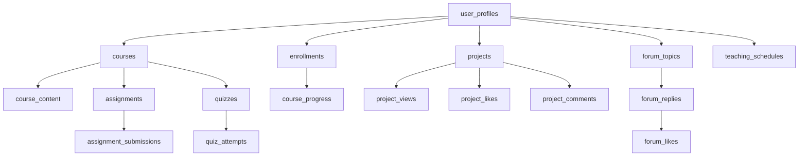

# Login Learning Platform - Complete Project Overview
## สรุปสิ่งที่ทำมาทั้งหมดในโปรเจค

---

## 📋 Table of Contents

1. [Project Overview](#project-overview)
2. [Technology Stack](#technology-stack)
3. [Complete Architecture](#complete-architecture)
4. [Database Design](#database-design)
5. [Frontend Components](#frontend-components)
6. [Backend Services](#backend-services)
7. [Integration Systems](#integration-systems)
8. [Security Implementation](#security-implementation)
9. [Development Timeline](#development-timeline)
10. [Current System Status](#current-system-status)
11. [Deployment Guide](#deployment-guide)
12. [Troubleshooting](#troubleshooting)

---

# Project Overview

**Login Learning Platform** เป็นแพลตฟอร์มการศึกษาออนไลน์สำหรับน้องๆ มัธยมปลาย ที่มุ่งเน้นการเรียนรู้ด้านวิศวกรรม เพื่อช่วยในการค้นหาความถนัดและเตรียมตัวสู่การศึกษาต่อในคณะวิศวกรรม

## 🎯 Main Goals
- **การศึกษา**: แพลตฟอร์มเรียนออนไลน์ครบวงจร
- **วิศวกรรม**: เฉพาะทางด้านวิศวกรรมหลากหลายสาขา
- **มัธยมปลาย**: กลุ่มเป้าหมายนักเรียน ม.4-6
- **Multi-Company**: รองรับหลายบริษัท/องค์กร

---

# Technology Stack

## 🎨 Frontend Technologies

```javascript
// Core Framework
React 18.2.0          // Main UI framework
Vite 5.0.0             // Build tool and development server

// UI/UX Libraries  
Tailwind CSS 3.4.0    // Utility-first CSS framework
Lucide React 0.263.1  // Icon library
Framer Motion 10.16.1 // Animation library (legacy components)
@radix-ui/*           // Headless UI components

// Form Handling
React Hook Form 7.45.4 // Form validation and handling

// Routing
React Router DOM 6.15.0 // Client-side routing

// State Management
React Context API      // Global state management

// File Handling
React Dropzone 14.2.3 // File drag & drop
```

## 🗄️ Backend Technologies

```javascript
// Database
Supabase (PostgreSQL)  // Main database and backend-as-a-service
Row Level Security     // Advanced security policies

// Authentication
Supabase Auth         // User authentication system

// File Storage
Google Drive API      // Primary file storage
Supabase Storage     // Secondary file storage

// API Server
Express.js 4.18.2    // Google Drive integration server
CORS 2.8.5           // Cross-origin resource sharing
```

## ☁️ Deployment & Infrastructure

```yaml
# Frontend Deployment
Platform: Vercel
URL: https://login-learning-platform-7pi9e05uq-techity-3442s-projects.vercel.app
Build Time: ~5.69s
Bundle Size: 2.3MB total

# Backend Services
Supabase Project ID: vuitwzisazvikrhtfthh
Google Drive Server: Express.js (custom deployment)
```

---

# Complete Architecture

## 📁 Project Structure

```
/Users/techit/Desktop/Code/New Web Login/
├── 📁 src/
│   ├── 📁 components/        # UI Components (60+ files)
│   │   ├── ui/              # Reusable UI elements
│   │   ├── forms/           # Form components
│   │   ├── schedule/        # Teaching schedule components
│   │   └── draggable/       # Drag & drop components
│   ├── 📁 pages/            # Main pages (23+ files)
│   │   ├── HomePage.jsx     # 3D Isometric mind map
│   │   ├── Admin*.jsx       # Admin panel pages
│   │   └── TeachingSchedulePageNew.jsx # Real-time schedules
│   ├── 📁 lib/              # Services & utilities (27+ files)
│   │   ├── supabaseClient.js
│   │   ├── googleDrive*.js
│   │   └── *Service.js      # Business logic services
│   ├── 📁 contexts/         # React contexts
│   │   ├── AuthContext.jsx  # Authentication
│   │   └── CompanyContext.jsx # Multi-company
│   └── 📁 hooks/            # Custom hooks
├── 📁 sql_scripts/          # Database migrations
├── 📁 server.js             # Google Drive API server
└── 📁 credentials/          # Google service account
```

## 🏗️ System Architecture Diagram

```
┌─────────────────┐    ┌──────────────────┐    ┌─────────────────┐
│   Frontend      │    │   Backend APIs   │    │   External APIs │
│   (React/Vite)  │◄──►│   (Supabase)     │◄──►│   (Google APIs) │
└─────────────────┘    └──────────────────┘    └─────────────────┘
         │                        │                        │
         ▼                        ▼                        ▼
┌─────────────────┐    ┌──────────────────┐    ┌─────────────────┐
│   Static Files  │    │   PostgreSQL     │    │   Google Drive  │
│   (Vercel CDN)  │    │   (Supabase DB)  │    │   (File Storage)│
└─────────────────┘    └──────────────────┘    └─────────────────┘
```

---

# Database Design

## 📊 Complete Database Schema

### Core Tables (19 Tables Total)

#### 👥 User Management
```sql
-- user_profiles: ข้อมูลผู้ใช้และบทบาท
CREATE TABLE user_profiles (
  id UUID PRIMARY KEY DEFAULT gen_random_uuid(),
  user_id UUID REFERENCES auth.users(id) ON DELETE CASCADE,
  full_name TEXT NOT NULL,
  email TEXT UNIQUE NOT NULL,
  role TEXT NOT NULL CHECK (role IN ('student', 'instructor', 'admin')),
  phone TEXT,
  avatar_url TEXT,
  company TEXT DEFAULT 'login',
  created_at TIMESTAMPTZ DEFAULT NOW(),
  updated_at TIMESTAMPTZ DEFAULT NOW()
);
```

#### 📚 Learning Management System
```sql
-- courses: คอร์สเรียนหลัก
CREATE TABLE courses (
  id UUID PRIMARY KEY DEFAULT gen_random_uuid(),
  title TEXT NOT NULL,
  description TEXT,
  instructor_id UUID REFERENCES user_profiles(user_id),
  instructor_name TEXT,
  thumbnail_url TEXT,
  preview_video_url TEXT,
  category TEXT,
  difficulty_level TEXT CHECK (difficulty_level IN ('beginner', 'intermediate', 'advanced')),
  duration_hours INTEGER,
  price DECIMAL(10,2) DEFAULT 0,
  is_free BOOLEAN DEFAULT TRUE,
  is_published BOOLEAN DEFAULT FALSE,
  company TEXT DEFAULT 'login',
  created_at TIMESTAMPTZ DEFAULT NOW(),
  updated_at TIMESTAMPTZ DEFAULT NOW()
);

-- course_content: เนื้อหาคอร์สแบบโมดูล
CREATE TABLE course_content (
  id UUID PRIMARY KEY DEFAULT gen_random_uuid(),
  course_id UUID REFERENCES courses(id) ON DELETE CASCADE,
  title TEXT NOT NULL,
  content TEXT, -- Rich text content
  type TEXT CHECK (type IN ('lesson', 'video', 'quiz', 'assignment', 'document')),
  video_url TEXT,
  document_url TEXT,
  duration_minutes INTEGER DEFAULT 0,
  order_index INTEGER DEFAULT 0,
  is_preview BOOLEAN DEFAULT FALSE,
  is_locked BOOLEAN DEFAULT FALSE,
  created_at TIMESTAMPTZ DEFAULT NOW(),
  updated_at TIMESTAMPTZ DEFAULT NOW()
);

-- enrollments: การลงทะเบียนเรียน
CREATE TABLE enrollments (
  id UUID PRIMARY KEY DEFAULT gen_random_uuid(),
  user_id UUID REFERENCES user_profiles(user_id) ON DELETE CASCADE,
  course_id UUID REFERENCES courses(id) ON DELETE CASCADE,
  enrolled_at TIMESTAMPTZ DEFAULT NOW(),
  progress_percentage DECIMAL(5,2) DEFAULT 0,
  completed_at TIMESTAMPTZ,
  company TEXT DEFAULT 'login',
  UNIQUE(user_id, course_id)
);

-- course_progress: ความคืบหน้าการเรียน
CREATE TABLE course_progress (
  id UUID PRIMARY KEY DEFAULT gen_random_uuid(),
  user_id UUID REFERENCES user_profiles(user_id) ON DELETE CASCADE,
  course_id UUID REFERENCES courses(id) ON DELETE CASCADE,
  content_id UUID REFERENCES course_content(id) ON DELETE CASCADE,
  completed BOOLEAN DEFAULT FALSE,
  completed_at TIMESTAMPTZ,
  time_spent_seconds INTEGER DEFAULT 0,
  last_position_seconds INTEGER DEFAULT 0,
  notes TEXT,
  created_at TIMESTAMPTZ DEFAULT NOW(),
  updated_at TIMESTAMPTZ DEFAULT NOW(),
  UNIQUE(user_id, course_id, content_id)
);

-- video_progress: ความคืบหน้าการดูวิดีโอ
CREATE TABLE video_progress (
  id UUID PRIMARY KEY DEFAULT gen_random_uuid(),
  user_id UUID REFERENCES user_profiles(user_id) ON DELETE CASCADE,
  course_id UUID REFERENCES courses(id) ON DELETE CASCADE,
  content_id UUID REFERENCES course_content(id) ON DELETE CASCADE,
  video_url TEXT NOT NULL,
  current_time DECIMAL(10,2) DEFAULT 0,
  duration DECIMAL(10,2) DEFAULT 0,
  completed BOOLEAN DEFAULT FALSE,
  last_watched_at TIMESTAMPTZ DEFAULT NOW(),
  session_id TEXT, -- Track individual viewing sessions
  watch_count INTEGER DEFAULT 0,
  UNIQUE(user_id, course_id, content_id, video_url)
);
```

#### 📝 Assessment System
```sql
-- assignments: ระบบงานที่มอบหมาย
CREATE TABLE assignments (
  id UUID PRIMARY KEY DEFAULT gen_random_uuid(),
  course_id UUID REFERENCES courses(id) ON DELETE CASCADE,
  title TEXT NOT NULL,
  description TEXT,
  instructions TEXT,
  due_date TIMESTAMPTZ,
  max_score INTEGER DEFAULT 100,
  submission_type TEXT DEFAULT 'file' CHECK (submission_type IN ('file', 'text', 'url')),
  is_published BOOLEAN DEFAULT FALSE,
  created_by UUID REFERENCES user_profiles(user_id),
  created_at TIMESTAMPTZ DEFAULT NOW(),
  updated_at TIMESTAMPTZ DEFAULT NOW()
);

-- assignment_submissions: การส่งงาน
CREATE TABLE assignment_submissions (
  id UUID PRIMARY KEY DEFAULT gen_random_uuid(),
  assignment_id UUID REFERENCES assignments(id) ON DELETE CASCADE,
  student_id UUID REFERENCES user_profiles(user_id) ON DELETE CASCADE,
  submission_text TEXT,
  file_url TEXT,
  submitted_at TIMESTAMPTZ DEFAULT NOW(),
  score INTEGER,
  feedback TEXT,
  graded_at TIMESTAMPTZ,
  graded_by UUID REFERENCES user_profiles(user_id),
  status TEXT DEFAULT 'submitted' CHECK (status IN ('draft', 'submitted', 'graded', 'returned')),
  UNIQUE(assignment_id, student_id)
);

-- quizzes: ระบบแบบทดสอบ
CREATE TABLE quizzes (
  id UUID PRIMARY KEY DEFAULT gen_random_uuid(),
  course_id UUID REFERENCES courses(id) ON DELETE CASCADE,
  title TEXT NOT NULL,
  description TEXT,
  questions JSONB NOT NULL, -- Array of question objects
  time_limit_minutes INTEGER,
  max_attempts INTEGER DEFAULT 1,
  passing_score INTEGER DEFAULT 70,
  is_published BOOLEAN DEFAULT FALSE,
  created_by UUID REFERENCES user_profiles(user_id),
  created_at TIMESTAMPTZ DEFAULT NOW(),
  updated_at TIMESTAMPTZ DEFAULT NOW()
);

-- quiz_attempts: การทำแบบทดสอบ
CREATE TABLE quiz_attempts (
  id UUID PRIMARY KEY DEFAULT gen_random_uuid(),
  quiz_id UUID REFERENCES quizzes(id) ON DELETE CASCADE,
  student_id UUID REFERENCES user_profiles(user_id) ON DELETE CASCADE,
  answers JSONB NOT NULL, -- User's answers
  score INTEGER DEFAULT 0,
  max_score INTEGER DEFAULT 0,
  started_at TIMESTAMPTZ DEFAULT NOW(),
  completed_at TIMESTAMPTZ,
  time_taken_seconds INTEGER,
  attempt_number INTEGER DEFAULT 1
);
```

#### 🎯 Project Showcase System
```sql
-- projects: ระบบแสดงผลงาน
CREATE TABLE projects (
  id UUID PRIMARY KEY DEFAULT gen_random_uuid(),
  title TEXT NOT NULL,
  description TEXT,
  content TEXT, -- Rich text content
  thumbnail_url TEXT,
  project_url TEXT,
  github_url TEXT,
  technologies JSONB, -- Array of technologies used
  category TEXT,
  difficulty_level TEXT CHECK (difficulty_level IN ('beginner', 'intermediate', 'advanced')),
  is_featured BOOLEAN DEFAULT FALSE,
  is_approved BOOLEAN DEFAULT FALSE,
  created_by UUID REFERENCES user_profiles(user_id),
  company TEXT DEFAULT 'login',
  google_drive_folder_id TEXT, -- Google Drive integration
  views_count INTEGER DEFAULT 0,
  likes_count INTEGER DEFAULT 0,
  created_at TIMESTAMPTZ DEFAULT NOW(),
  updated_at TIMESTAMPTZ DEFAULT NOW()
);

-- project_views: การดูโปรเจค
CREATE TABLE project_views (
  id UUID PRIMARY KEY DEFAULT gen_random_uuid(),
  project_id UUID REFERENCES projects(id) ON DELETE CASCADE,
  user_id UUID REFERENCES user_profiles(user_id) ON DELETE CASCADE,
  viewed_at TIMESTAMPTZ DEFAULT NOW(),
  ip_address INET,
  user_agent TEXT,
  UNIQUE(project_id, user_id, DATE(viewed_at))
);

-- project_likes: การกดไลค์โปรเจค
CREATE TABLE project_likes (
  id UUID PRIMARY KEY DEFAULT gen_random_uuid(),
  project_id UUID REFERENCES projects(id) ON DELETE CASCADE,
  user_id UUID REFERENCES user_profiles(user_id) ON DELETE CASCADE,
  liked_at TIMESTAMPTZ DEFAULT NOW(),
  UNIQUE(project_id, user_id)
);

-- project_comments: ความคิดเห็นโปรเจค
CREATE TABLE project_comments (
  id UUID PRIMARY KEY DEFAULT gen_random_uuid(),
  project_id UUID REFERENCES projects(id) ON DELETE CASCADE,
  user_id UUID REFERENCES user_profiles(user_id) ON DELETE CASCADE,
  comment TEXT NOT NULL,
  parent_comment_id UUID REFERENCES project_comments(id),
  created_at TIMESTAMPTZ DEFAULT NOW(),
  updated_at TIMESTAMPTZ DEFAULT NOW()
);
```

#### 💬 Community Features
```sql
-- forum_topics: หัวข้อฟอรั่ม
CREATE TABLE forum_topics (
  id UUID PRIMARY KEY DEFAULT gen_random_uuid(),
  title TEXT NOT NULL,
  content TEXT NOT NULL,
  category TEXT,
  tags JSONB, -- Array of tags
  is_pinned BOOLEAN DEFAULT FALSE,
  is_locked BOOLEAN DEFAULT FALSE,
  created_by UUID REFERENCES user_profiles(user_id),
  views_count INTEGER DEFAULT 0,
  replies_count INTEGER DEFAULT 0,
  last_reply_at TIMESTAMPTZ,
  created_at TIMESTAMPTZ DEFAULT NOW(),
  updated_at TIMESTAMPTZ DEFAULT NOW()
);

-- forum_replies: การตอบกลับฟอรั่ม
CREATE TABLE forum_replies (
  id UUID PRIMARY KEY DEFAULT gen_random_uuid(),
  topic_id UUID REFERENCES forum_topics(id) ON DELETE CASCADE,
  content TEXT NOT NULL,
  parent_reply_id UUID REFERENCES forum_replies(id),
  created_by UUID REFERENCES user_profiles(user_id),
  likes_count INTEGER DEFAULT 0,
  created_at TIMESTAMPTZ DEFAULT NOW(),
  updated_at TIMESTAMPTZ DEFAULT NOW()
);

-- forum_likes: การกดไลค์ฟอรั่ม
CREATE TABLE forum_likes (
  id UUID PRIMARY KEY DEFAULT gen_random_uuid(),
  reply_id UUID REFERENCES forum_replies(id) ON DELETE CASCADE,
  user_id UUID REFERENCES user_profiles(user_id) ON DELETE CASCADE,
  created_at TIMESTAMPTZ DEFAULT NOW(),
  UNIQUE(reply_id, user_id)
);
```

#### 🗂️ File Management
```sql
-- attachments: ระบบไฟล์แนบ
CREATE TABLE attachments (
  id UUID PRIMARY KEY DEFAULT gen_random_uuid(),
  filename TEXT NOT NULL,
  original_filename TEXT NOT NULL,
  file_url TEXT NOT NULL,
  file_size INTEGER,
  mime_type TEXT,
  attached_to_type TEXT, -- 'course', 'project', 'forum', etc.
  attached_to_id UUID,
  uploaded_by UUID REFERENCES user_profiles(user_id),
  is_public BOOLEAN DEFAULT TRUE,
  download_count INTEGER DEFAULT 0,
  created_at TIMESTAMPTZ DEFAULT NOW()
);
```

#### 🏆 Gamification
```sql
-- achievements: ระบบรางวัลและแบดจ์
CREATE TABLE achievements (
  id UUID PRIMARY KEY DEFAULT gen_random_uuid(),
  user_id UUID REFERENCES user_profiles(user_id) ON DELETE CASCADE,
  title TEXT NOT NULL,
  description TEXT,
  badge_icon TEXT,
  badge_color TEXT,
  achievement_type TEXT, -- 'course_completion', 'project_approval', etc.
  earned_at TIMESTAMPTZ DEFAULT NOW(),
  points INTEGER DEFAULT 0
);
```

#### 📅 Teaching Schedule Management
```sql
-- teaching_courses: คอร์สสำหรับจัดตาราง
CREATE TABLE teaching_courses (
  id UUID PRIMARY KEY DEFAULT gen_random_uuid(),
  name TEXT NOT NULL,
  code TEXT,
  description TEXT,
  instructor_id UUID REFERENCES user_profiles(user_id),
  color TEXT DEFAULT 'bg-blue-500',
  company TEXT DEFAULT 'login',
  is_active BOOLEAN DEFAULT TRUE,
  created_at TIMESTAMPTZ DEFAULT NOW(),
  updated_at TIMESTAMPTZ DEFAULT NOW()
);

-- teaching_schedules: ตารางสอนแบบ real-time
CREATE TABLE teaching_schedules (
  id UUID PRIMARY KEY DEFAULT gen_random_uuid(),
  week_start_date DATE NOT NULL,
  day_of_week INTEGER NOT NULL CHECK (day_of_week >= 0 AND day_of_week <= 6),
  time_slot_index INTEGER NOT NULL CHECK (time_slot_index >= 0 AND time_slot_index <= 6),
  course_id UUID REFERENCES teaching_courses(id) ON DELETE SET NULL,
  course_title TEXT NOT NULL,
  course_code TEXT,
  instructor_id UUID REFERENCES user_profiles(user_id) ON DELETE SET NULL,
  instructor_name TEXT NOT NULL,
  room TEXT DEFAULT 'TBD',
  notes TEXT,
  color TEXT DEFAULT 'bg-blue-500',
  company TEXT DEFAULT 'login',
  duration INTEGER DEFAULT 1 CHECK (duration >= 1 AND duration <= 6),
  created_by UUID REFERENCES user_profiles(user_id),
  updated_by UUID REFERENCES user_profiles(user_id),
  created_at TIMESTAMPTZ DEFAULT NOW(),
  updated_at TIMESTAMPTZ DEFAULT NOW(),
  version INTEGER DEFAULT 1,
  CONSTRAINT unique_schedule_slot UNIQUE (week_start_date, day_of_week, time_slot_index, company)
);

-- weekly_schedules: สรุปตารางรายสัปดาห์
CREATE TABLE weekly_schedules (
  id UUID PRIMARY KEY DEFAULT gen_random_uuid(),
  week_start_date DATE NOT NULL,
  instructor_id UUID REFERENCES user_profiles(user_id),
  schedule_data JSONB, -- Full week schedule data
  company TEXT DEFAULT 'login',
  created_by UUID REFERENCES user_profiles(user_id),
  updated_by UUID REFERENCES user_profiles(user_id),
  created_at TIMESTAMPTZ DEFAULT NOW(),
  updated_at TIMESTAMPTZ DEFAULT NOW(),
  version INTEGER DEFAULT 1,
  UNIQUE(week_start_date, instructor_id, company)
);
```

#### ⚙️ System Configuration
```sql
-- user_settings: การตั้งค่าผู้ใช้
CREATE TABLE user_settings (
  id UUID PRIMARY KEY DEFAULT gen_random_uuid(),
  user_id UUID REFERENCES user_profiles(user_id) ON DELETE CASCADE,
  theme TEXT DEFAULT 'light' CHECK (theme IN ('light', 'dark', 'system')),
  language TEXT DEFAULT 'th' CHECK (language IN ('th', 'en')),
  notification_email BOOLEAN DEFAULT TRUE,
  notification_push BOOLEAN DEFAULT TRUE,
  timezone TEXT DEFAULT 'Asia/Bangkok',
  preferences JSONB DEFAULT '{}',
  created_at TIMESTAMPTZ DEFAULT NOW(),
  updated_at TIMESTAMPTZ DEFAULT NOW(),
  UNIQUE(user_id)
);
```

### 🔗 Database Relationships



---

# Frontend Components

## 🎨 Complete Component Inventory

### 📄 Main Pages (23+ Components)

#### Public Pages
1. **HomePage.jsx** (3D Isometric Design)
   - 3D CSS animations with floating engineering cards
   - Interactive tooltips for 6 engineering fields
   - Performance-optimized animations
   - Responsive design

2. **CoursesPage.jsx** (Course Catalog)
   - Advanced filtering and search
   - Category-based navigation
   - Course preview modals
   - Enrollment tracking

3. **ProjectsPage.jsx** (Project Showcase)
   - Advanced filtering system
   - Company-based categorization
   - Like/View tracking
   - Interactive project cards

4. **CourseDetailPage.jsx** & **CourseLearningPage.jsx**
   - Rich content display
   - Progress tracking
   - Video player integration
   - Assignment submission

#### Authentication Pages
5. **LoginPage.jsx** & **SignupPage.jsx**
   - Form validation
   - Social login options
   - Error handling

6. **ForgotPasswordPage.jsx** & **ResetPasswordPageNew.jsx**
   - Password recovery flow
   - Email verification
   - Secure token handling

#### Admin Panel (8+ Pages)
7. **AdminPage.jsx** - Dashboard overview
8. **AdminUsersPage.jsx** - User management
9. **AdminCoursesPage.jsx** - Course management
10. **AdminCourseContentPage.jsx** - Content editor
11. **AdminProjectsPage.jsx** - Project management with Google Drive
12. **AdminAssignmentGradingPage.jsx** - Grading interface
13. **AdminGoogleDrivePage.jsx** - File management

#### Specialized Pages
14. **TeachingSchedulePageNew.jsx** (Real-time Collaboration)
    - Drag & Drop interface with react-dnd
    - Real-time synchronization via Supabase Realtime
    - Optimistic UI updates
    - Conflict resolution
    - Connection status monitoring

### 🧩 UI Components (60+ Components)

#### Layout & Navigation
```javascript
// Core Layout Components
- Navbar.jsx              // Responsive navigation
- Footer.jsx               // Site footer
- AdminLayout.jsx          // Admin sidebar layout  
- CompanyLayout.jsx        // Multi-company wrapper
- Breadcrumb.jsx          // Navigation breadcrumbs
- SEOHead.jsx             // SEO meta management
```

#### Content Management
```javascript
// Rich Content Components
- ContentEditor.jsx        // Rich text editor with file upload
- CourseSlider.jsx         // Interactive course carousel
- ProjectSlider.jsx        // Project showcase slider  
- TestimonialSlider.jsx    // Student testimonials
- ProjectShowcase.jsx      // Featured project display
- VideoPlayer.jsx          // Custom video player
- AttachmentViewer.jsx     // File preview component
```

#### Form Components
```javascript
// Form Management
- ProjectForm.jsx          // Project creation with Google Drive
- CreateProjectForm.jsx    // Simplified creation
- EditProjectForm.jsx      // Project editing
- CreateCourseForm.jsx     // Course creation
- EditCourseForm.jsx       // Course editing
- OnsiteRegistrationForm.jsx // Program registration
```

#### Interactive Features
```javascript
// Assessment System
- AssignmentEditor.jsx     // Assignment creation
- AssignmentPlayer.jsx     // Assignment completion
- QuizEditor.jsx          // Quiz management
- QuizPlayer.jsx          // Quiz taking interface
- GradingModal.jsx        // Grading interface

// Forum System
- ForumTopicCard.jsx      // Topic display
- ForumTopicDetail.jsx    // Topic details
- CreateTopicModal.jsx    // Topic creation
```

#### File Management
```javascript
// File Handling
- FileUpload.jsx          // General file upload
- FileUploadZone.jsx      // Drag & drop zone
- UniversalFileUpload.jsx // Universal handler
- CourseImageUpload.jsx   // Course thumbnails
- GoogleDriveManager.jsx  // Drive integration
```

#### Teaching Schedule System
```javascript
// Drag & Drop Schedule Components
- schedule/CourseManager.jsx      // Course management
- schedule/ScheduleItem.jsx       // Schedule item display
- schedule/WeekPicker.jsx         // Week selection
- draggable/DraggableCourse.jsx   // Draggable course
- draggable/DraggableInstructor.jsx // Draggable instructor
```

### 🎯 Component Features

#### 3D Homepage Design
- **Isometric 3D Layout**: CSS transforms for 3D perspective
- **Engineering Mind Map**: 6 engineering fields with interactive cards
- **Floating Animations**: CSS keyframes for smooth animations  
- **Responsive Design**: Mobile-first approach
- **Performance**: Pure CSS animations (no heavy libraries)

#### Real-time Teaching Schedules
- **Google Sheets-like Collaboration**: Multiple users editing simultaneously
- **Drag & Drop Interface**: Intuitive course scheduling
- **Optimistic Updates**: Immediate UI feedback
- **Conflict Resolution**: Version control for simultaneous edits
- **WebSocket Integration**: Supabase Realtime for live sync

#### Google Drive Integration
- **Smart File Management**: Automatic folder organization
- **Course-based Structure**: Files organized by course name
- **Duplicate Prevention**: Checks for existing folders
- **Web-based Operations**: Upload/delete through UI
- **Error Recovery**: Comprehensive error handling

---

# Backend Services

## 🔧 Service Layer Architecture

### Core Business Logic Services

#### 📚 Course Management (`courseService.js`)
```javascript
// Core Functions
- fetchCourses()           // Get course catalog
- fetchCourseById(id)      // Single course details  
- createCourse(data)       // Admin course creation
- updateCourse(id, data)   // Course modifications
- deleteCourse(id)         // Course removal
- publishCourse(id)        // Course publishing
- fetchEnrolledCourses(userId) // Student enrollments
```

#### 🎯 Project Management (`projectService.js`)
```javascript
// Project Operations
- fetchProjects(filters)   // Project catalog with filtering
- fetchProjectById(id)     // Single project details
- createProject(data)      // Project creation + Google Drive
- updateProject(id, data)  // Project modifications
- deleteProject(id)        // Project + Drive cleanup
- approveProject(id)       // Admin approval
- toggleProjectLike(id)    // Like/unlike functionality
- incrementProjectViews(id) // View tracking
```

#### 👥 User Management (`userService.js`)
```javascript
// User Operations  
- fetchUserProfile(userId) // Get user profile
- updateUserProfile(data)  // Profile updates
- fetchUsers(filters)      // Admin user management
- updateUserRole(userId, role) // Role assignment
- fetchInstructors()       // Get all instructors
```

#### 📈 Progress Tracking (`progressService.js`)
```javascript
// Learning Progress
- updateCourseProgress(userId, courseId, contentId)
- fetchUserProgress(userId, courseId)
- updateVideoProgress(userId, videoData)
- fetchVideoProgress(userId, videoUrl)
- calculateCompletionPercentage(userId, courseId)
```

#### 📝 Assignment System (`assignmentService.js`)
```javascript
// Assignment Management
- fetchAssignments(courseId) // Course assignments
- createAssignment(data)     // Assignment creation
- submitAssignment(data)     // Student submission
- gradeAssignment(id, data)  // Instructor grading
- fetchSubmissions(assignmentId) // All submissions
```

### Integration Services

#### 🗄️ Database Client (`supabaseClient.js`)
```javascript
// Supabase Configuration
import { createClient } from '@supabase/supabase-js';

const supabaseUrl = import.meta.env.VITE_SUPABASE_URL;
const supabaseAnonKey = import.meta.env.VITE_SUPABASE_ANON_KEY;

export const supabase = createClient(supabaseUrl, supabaseAnonKey);
```

#### ☁️ Google Drive Services

**Server-side (`googleDriveService.js`)**
```javascript
// Google Drive API Server Operations
class GoogleDriveService {
  constructor() {
    this.auth = new google.auth.JWT({
      email: credentials.client_email,
      key: credentials.private_key,
      scopes: ['https://www.googleapis.com/auth/drive']
    });
  }

  // Core Methods
  async createFolder(name, parentId)
  async uploadFile(fileBuffer, filename, folderId)  
  async deleteFile(fileId)
  async listFiles(folderId)
  async createProjectStructure(projectData, company)
}
```

**Client-side (`googleDriveClientService.js`)**
```javascript
// Frontend Google Drive Integration
const API_BASE_URL = 'http://127.0.0.1:3001/api/drive';

export const googleDriveClient = {
  // Project Management
  createProjectStructure: (projectData, company) => 
    fetch(`${API_BASE_URL}/create-course-structure`, {
      method: 'POST',
      body: JSON.stringify({ projectData, company })
    }),
  
  // File Operations  
  uploadFile: (file, folderId) =>
    fetch(`${API_BASE_URL}/simple-upload`, {
      method: 'POST', 
      body: formData
    }),
    
  deleteFile: (fileId, fileName) =>
    fetch(`${API_BASE_URL}/delete-file`, {
      method: 'DELETE',
      body: JSON.stringify({ fileId, fileName })
    })
};
```

### Feature-Specific Services

#### 📅 Teaching Schedule (`teachingScheduleService.js` & `realtimeScheduleService.js`)
```javascript
// Real-time Schedule Management
class RealtimeScheduleService {
  constructor() {
    this.supabase = supabase;
    this.channel = null;
  }

  // Real-time Operations
  async subscribeToSchedules(weekStartDate, callback) {
    this.channel = this.supabase
      .channel('schedule-changes')
      .on('postgres_changes', {
        event: '*',
        schema: 'public', 
        table: 'teaching_schedules'
      }, callback)
      .subscribe();
  }

  // CRUD Operations with Optimistic Updates
  async addSchedule(scheduleData) {
    // Optimistic update to UI
    const optimisticUpdate = this.applyOptimisticUpdate(scheduleData);
    
    try {
      const result = await this.supabase
        .from('teaching_schedules')
        .insert(scheduleData)
        .select()
        .single();
      return result;
    } catch (error) {
      // Rollback optimistic update
      this.rollbackOptimisticUpdate(optimisticUpdate);
      throw error;
    }
  }

  async removeSchedule(scheduleId) {
    // Similar optimistic pattern
  }
}
```

#### 💬 Forum System (`forumService.js`)
```javascript
// Forum Management
export const forumService = {
  // Topic Management
  fetchTopics: (filters) => supabase
    .from('forum_topics')
    .select('*, user_profiles(full_name, avatar_url)')
    .order('created_at', { ascending: false }),

  createTopic: (data) => supabase
    .from('forum_topics') 
    .insert(data),

  // Reply System
  fetchReplies: (topicId) => supabase
    .from('forum_replies')
    .select('*, user_profiles(full_name, avatar_url)')
    .eq('topic_id', topicId),

  // Like System  
  toggleLike: async (replyId, userId) => {
    const { data: existing } = await supabase
      .from('forum_likes')
      .select('id')
      .eq('reply_id', replyId)
      .eq('user_id', userId)
      .single();

    if (existing) {
      return supabase.from('forum_likes').delete().eq('id', existing.id);
    } else {
      return supabase.from('forum_likes').insert({ reply_id: replyId, user_id: userId });
    }
  }
};
```

### Utility Services

#### 🔒 Validation (`validationSchemas.js`)
```javascript
// Form Validation Schemas (using custom validation)
export const projectValidation = {
  title: {
    required: true,
    minLength: 3,
    maxLength: 100
  },
  description: {
    required: true,
    minLength: 10,
    maxLength: 1000
  },
  technologies: {
    required: true,
    minItems: 1
  }
};

export const courseValidation = {
  title: { required: true, minLength: 3 },
  instructor_id: { required: true },
  category: { required: true },
  difficulty_level: { 
    required: true, 
    options: ['beginner', 'intermediate', 'advanced'] 
  }
};
```

#### 🚨 Error Handling (`errorHandler.js`)
```javascript
// Centralized Error Management
export class AppError extends Error {
  constructor(message, statusCode, code) {
    super(message);
    this.statusCode = statusCode;
    this.code = code;
    this.isOperational = true;
  }
}

export const errorHandler = {
  // Supabase Errors
  handleSupabaseError: (error) => {
    if (error?.code === 'PGRST116') {
      return new AppError('Database constraint violation', 400, 'CONSTRAINT_ERROR');
    }
    if (error?.code === '23505') {
      return new AppError('Duplicate entry', 400, 'DUPLICATE_ERROR');
    }
    return new AppError('Database error', 500, 'DATABASE_ERROR');
  },

  // Google Drive Errors
  handleDriveError: (error) => {
    if (error?.code === 403) {
      return new AppError('Google Drive permission denied', 403, 'DRIVE_PERMISSION');
    }
    if (error?.code === 404) {
      return new AppError('File not found in Google Drive', 404, 'DRIVE_NOT_FOUND');
    }
    return new AppError('Google Drive error', 500, 'DRIVE_ERROR');
  }
};
```

#### ⚡ Performance Utils (`performanceUtils.js`)
```javascript
// Performance Monitoring
export const performance = {
  // Cache Management
  cache: new Map(),
  
  getCached: (key, fetchFunction, ttl = 300000) => {
    const cached = performance.cache.get(key);
    if (cached && Date.now() - cached.timestamp < ttl) {
      return Promise.resolve(cached.data);
    }
    
    return fetchFunction().then(data => {
      performance.cache.set(key, {
        data,
        timestamp: Date.now()
      });
      return data;
    });
  },

  // Debouncing
  debounce: (func, wait) => {
    let timeout;
    return function executedFunction(...args) {
      const later = () => {
        clearTimeout(timeout);
        func(...args);
      };
      clearTimeout(timeout);
      timeout = setTimeout(later, wait);
    };
  },

  // Performance Monitoring
  measureTime: (name, func) => {
    const start = performance.now();
    const result = func();
    const end = performance.now();
    console.log(`${name} took ${end - start} milliseconds`);
    return result;
  }
};
```

---

# Integration Systems

## 🔗 Complete Integration Architecture

### Google Drive Integration

#### 🌟 Advanced Features Implemented

**1. Smart Folder Organization**
```javascript
// Folder Structure Created
Shared Drive (0AAMvBF62LaLyUk9PVA)
└── [LOGIN] (1xjUv7ruPHwiLhZJ42IeyfcKBkYP8CX4S)
    ├── 📚 คอร์สเรียน (Dynamic folder detection)
    │   ├── 📚 Course A - All files for Course A  
    │   ├── 📚 Course B - All files for Course B
    │   └── 📚 Course C - All files for Course C
    └── 🎯 โปรเจค (148MPiUE7WLAvluF1o2VuPA2VlplzJMJF)
        └── 🔧 Project Name ← Files uploaded here
```

**2. Duplicate Folder Prevention**
```javascript
// Smart Detection Algorithm
const detectExistingFolder = async (parentId, folderName) => {
  const listData = await googleDriveService.listFiles(parentId);
  return listData.files?.find(file => 
    file.name.includes(folderName) && 
    file.mimeType === 'application/vnd.google-apps.folder'
  );
};

// Usage in ContentEditor
const existingCoursesFolder = await detectExistingFolder(loginFolderId, 'คอร์สเรียน');
if (existingCoursesFolder) {
  coursesFolderId = existingCoursesFolder.id;
} else {
  // Create new folder only if doesn't exist
  const newFolder = await createFolder('📚 คอร์สเรียน', loginFolderId);
  coursesFolderId = newFolder.id;
}
```

**3. File Management System**
```javascript
// Complete File Operations
export class FileManagerService {
  // Upload with automatic organization
  async uploadCourseFile(file, courseTitle) {
    const folderStructure = await this.ensureFolderStructure(courseTitle);
    return await this.uploadToFolder(file, folderStructure.courseFolderId);
  }

  // Delete with confirmation
  async deleteFile(fileId, fileName) {
    const confirmation = window.confirm(`ลบไฟล์ "${fileName}" หรือไม่?`);
    if (!confirmation) return false;
    
    return await googleDriveClient.deleteFile(fileId, fileName);
  }

  // Folder structure validation
  async ensureFolderStructure(courseTitle) {
    const loginFolder = await this.findOrCreateLoginFolder();
    const coursesFolder = await this.findOrCreateCoursesFolder(loginFolder.id);
    const courseFolder = await this.findOrCreateCourseFolder(coursesFolder.id, courseTitle);
    
    return {
      loginFolderId: loginFolder.id,
      coursesFolderId: coursesFolder.id, 
      courseFolderId: courseFolder.id
    };
  }
}
```

#### 🔧 Express.js Server Implementation

**Server Architecture (`server.js`)**
```javascript
const express = require('express');
const { google } = require('googleapis');
const formidable = require('formidable');
const cors = require('cors');

const app = express();
const PORT = 3001;

// Google Drive Authentication
const credentials = require('./credentials/google-drive-service-account.json');
const auth = new google.auth.JWT({
  email: credentials.client_email,
  key: credentials.private_key,
  scopes: [
    'https://www.googleapis.com/auth/drive',
    'https://www.googleapis.com/auth/drive.file'
  ]
});

const drive = google.drive({ version: 'v3', auth });

// CORS Configuration
app.use(cors({
  origin: [
    'http://localhost:5173',
    'http://localhost:5174', 
    'http://localhost:5175',
    'https://login-learning-platform-7pi9e05uq-techity-3442s-projects.vercel.app'
  ],
  credentials: true
}));

// API Endpoints
app.post('/api/drive/simple-upload', async (req, res) => {
  const form = formidable({ multiples: false });
  
  form.parse(req, async (err, fields, files) => {
    try {
      const file = files.file;
      const folderId = fields.folderId;
      
      const fileMetadata = {
        name: file.originalFilename,
        parents: [folderId]
      };

      const media = {
        mimeType: file.mimetype,
        body: fs.createReadStream(file.filepath)
      };

      const response = await drive.files.create({
        requestBody: fileMetadata,
        media,
        fields: 'id,name,size,createdTime,webViewLink,parents',
        supportsAllDrives: true,
        supportsTeamDrives: true,
        driveId: process.env.GOOGLE_DRIVE_FOLDER_ID
      });

      res.json({ 
        success: true, 
        file: response.data,
        message: `อัปโหลดไฟล์ "${file.originalFilename}" สำเร็จ`
      });
    } catch (error) {
      res.status(500).json({ 
        success: false, 
        error: error.message 
      });
    }
  });
});

app.delete('/api/drive/delete-file', async (req, res) => {
  try {
    const { fileId, fileName } = req.body;
    
    await drive.files.delete({
      fileId,
      supportsAllDrives: true,
      supportsTeamDrives: true
    });

    res.json({ 
      success: true,
      message: `ลบไฟล์ "${fileName}" สำเร็จ`
    });
  } catch (error) {
    res.status(500).json({ 
      success: false, 
      error: error.message 
    });
  }
});

// Health Check
app.get('/health', (req, res) => {
  res.json({ 
    status: 'OK', 
    timestamp: new Date().toISOString(),
    services: {
      googleDrive: 'Connected',
      server: 'Running'
    }
  });
});

app.listen(PORT, '127.0.0.1', () => {
  console.log(`🚀 Google Drive API Server running on http://127.0.0.1:${PORT}`);
  console.log(`📊 Health check: http://127.0.0.1:${PORT}/health`);
});
```

### Supabase Integration

#### 🔒 Row Level Security (RLS) Implementation

**Complete Security Architecture**
```sql
-- Example RLS Policy Pattern
CREATE POLICY "policy_name" ON table_name
    FOR operation USING (
        -- Permission Logic
        auth.uid() = user_column OR
        EXISTS (
            SELECT 1 FROM user_profiles 
            WHERE user_id = auth.uid() AND role = 'admin'
        )
    );

-- Real Implementation Examples
-- 1. Courses - Public read, instructor/admin manage
CREATE POLICY "public_can_view_published_courses" ON courses
    FOR SELECT USING (is_published = true);

CREATE POLICY "instructors_admins_manage_courses" ON courses
    FOR ALL USING (
        EXISTS (
            SELECT 1 FROM user_profiles 
            WHERE user_id = auth.uid() 
            AND role IN ('instructor', 'admin')
        )
    );

-- 2. Projects - Public approved, creator/admin manage  
CREATE POLICY "public_can_view_approved_projects" ON projects
    FOR SELECT USING (is_approved = true);

CREATE POLICY "creators_admins_manage_projects" ON projects
    FOR ALL USING (
        created_by = auth.uid() OR
        EXISTS (
            SELECT 1 FROM user_profiles 
            WHERE user_id = auth.uid() AND role = 'admin'
        )
    );

-- 3. Enrollments - Self-access only
CREATE POLICY "users_manage_own_enrollments" ON enrollments
    FOR ALL USING (user_id = auth.uid());

-- 4. Teaching Schedules - Multi-role access
CREATE POLICY "authenticated_users_can_view_teaching_schedules" ON teaching_schedules
    FOR SELECT USING (auth.role() = 'authenticated');

CREATE POLICY "instructors_admins_can_manage_schedules" ON teaching_schedules
    FOR ALL USING (
        auth.role() = 'authenticated' AND (
            EXISTS (
                SELECT 1 FROM user_profiles 
                WHERE user_id = auth.uid() 
                AND role IN ('instructor', 'admin')
            )
            OR instructor_id = auth.uid()
            OR created_by = auth.uid()
        )
    );
```

#### 📡 Real-time Features Implementation

**Supabase Realtime Integration**
```javascript
// Real-time Hook Implementation
export const useRealtimeSchedule = (weekStartDate) => {
  const [schedules, setSchedules] = useState([]);
  const [loading, setLoading] = useState(true);
  const [error, setError] = useState(null);
  const [connectionStatus, setConnectionStatus] = useState('connecting');

  useEffect(() => {
    let channel;
    
    const setupRealtimeSubscription = async () => {
      try {
        // Initial data fetch
        const { data, error } = await supabase
          .from('teaching_schedules')
          .select(`
            *,
            teaching_courses!course_id(id, name, code),
            user_profiles!instructor_id(user_id, full_name)
          `)
          .eq('week_start_date', weekStartDate)
          .order('day_of_week')
          .order('time_slot_index');

        if (error) throw error;
        setSchedules(transformScheduleData(data || []));
        setLoading(false);

        // Real-time subscription
        channel = supabase
          .channel('schedule-changes')
          .on(
            'postgres_changes',
            {
              event: '*',
              schema: 'public',
              table: 'teaching_schedules'
            },
            (payload) => {
              console.log('Real-time update received:', payload);
              handleRealtimeUpdate(payload);
            }
          )
          .subscribe((status) => {
            console.log('Subscription status:', status);
            setConnectionStatus(status.toLowerCase());
            
            if (status === 'SUBSCRIBED') {
              setConnectionStatus('connected');
            } else if (status === 'CHANNEL_ERROR') {
              setConnectionStatus('error');
              // Fallback to polling
              startPolling();
            }
          });

      } catch (error) {
        console.error('Error setting up real-time subscription:', error);
        setError(error.message);
        setConnectionStatus('error');
        // Fallback to polling
        startPolling();
      }
    };

    const handleRealtimeUpdate = (payload) => {
      const { eventType, new: newRecord, old: oldRecord } = payload;
      
      setSchedules(prevSchedules => {
        switch (eventType) {
          case 'INSERT':
            return [...prevSchedules, transformSingleSchedule(newRecord)];
          
          case 'UPDATE':
            return prevSchedules.map(schedule =>
              schedule.id === newRecord.id 
                ? transformSingleSchedule(newRecord)
                : schedule
            );
          
          case 'DELETE':
            return prevSchedules.filter(schedule => 
              schedule.id !== oldRecord.id
            );
          
          default:
            return prevSchedules;
        }
      });
    };

    const startPolling = () => {
      // Fallback polling mechanism
      const pollInterval = setInterval(async () => {
        try {
          const { data } = await supabase
            .from('teaching_schedules')
            .select('*')
            .eq('week_start_date', weekStartDate);
          
          setSchedules(transformScheduleData(data || []));
        } catch (error) {
          console.error('Polling error:', error);
        }
      }, 5000);

      return () => clearInterval(pollInterval);
    };

    setupRealtimeSubscription();

    return () => {
      if (channel) {
        supabase.removeChannel(channel);
      }
    };
  }, [weekStartDate]);

  // Optimistic Updates
  const addScheduleOptimistic = async (scheduleData) => {
    // Apply optimistic update to UI immediately
    const optimisticSchedule = {
      ...scheduleData,
      id: `temp-${Date.now()}`,
      isOptimistic: true
    };
    
    setSchedules(prev => [...prev, optimisticSchedule]);

    try {
      // Send to server
      const { data, error } = await supabase
        .from('teaching_schedules')
        .insert(scheduleData)
        .select()
        .single();

      if (error) throw error;

      // Replace optimistic update with real data
      setSchedules(prev => 
        prev.map(schedule => 
          schedule.id === optimisticSchedule.id 
            ? transformSingleSchedule(data)
            : schedule
        )
      );

      return data;
    } catch (error) {
      // Rollback optimistic update
      setSchedules(prev => 
        prev.filter(schedule => schedule.id !== optimisticSchedule.id)
      );
      throw error;
    }
  };

  return {
    schedules,
    loading,
    error,
    connectionStatus,
    addScheduleOptimistic,
    // ... other methods
  };
};
```

### Multi-Company Architecture

#### 🏢 Company Context System
```javascript
// Company Configuration
export const COMPANIES = {
  login: {
    name: "Login Learning",
    color: "indigo",
    isDefault: true,
    description: "หลักสูตรวิศวกรรมสำหรับนักเรียนมัธยมปลาย",
    logo: "/logos/login-logo.png"
  },
  meta: {
    name: "Meta Tech Academy", 
    color: "blue",
    tracks: ["cyber", "data", "webapp", "ai"],
    description: "วิทยาลัยเทคโนโลยี Meta",
    logo: "/logos/meta-logo.png"
  },
  med: {
    name: "Med Solutions",
    color: "green", 
    description: "โซลูชันทางการแพทย์",
    logo: "/logos/med-logo.png"
  },
  edtech: {
    name: "EdTech Innovation",
    color: "purple",
    description: "นวัตกรรมการศึกษา",
    logo: "/logos/edtech-logo.png"
  },
  innotech: {
    name: "InnoTech Labs",
    color: "orange", 
    description: "ห้องปฏิบัติการนวัตกรรม",
    logo: "/logos/innotech-logo.png"
  },
  w2d: {
    name: "W2D Studio",
    color: "red",
    description: "สตูดิโอออกแบบ",
    logo: "/logos/w2d-logo.png"
  }
};

// Company Context Implementation
export const CompanyContext = createContext();

export const CompanyProvider = ({ children }) => {
  const [currentCompany, setCurrentCompany] = useState('login');
  const [companyData, setCompanyData] = useState(COMPANIES.login);

  const switchCompany = (companyId) => {
    if (COMPANIES[companyId]) {
      setCurrentCompany(companyId);
      setCompanyData(COMPANIES[companyId]);
      localStorage.setItem('selectedCompany', companyId);
    }
  };

  const getCompanyColor = (company = currentCompany) => {
    return COMPANIES[company]?.color || 'indigo';
  };

  const getCompanyName = (company = currentCompany) => {
    return COMPANIES[company]?.name || 'Login Learning';
  };

  useEffect(() => {
    const saved = localStorage.getItem('selectedCompany');
    if (saved && COMPANIES[saved]) {
      switchCompany(saved);
    }
  }, []);

  return (
    <CompanyContext.Provider value={{
      currentCompany,
      companyData,
      companies: COMPANIES,
      switchCompany,
      getCompanyColor,
      getCompanyName
    }}>
      {children}
    </CompanyContext.Provider>
  );
};
```

---

# Security Implementation

## 🔒 Comprehensive Security Architecture

### Database Security (95%+ Security Score)

#### RLS Policies Implemented (56+ Policies)

**1. User Profile Security**
```sql
-- Users can only see their own profiles
CREATE POLICY "users_can_view_own_profile" ON user_profiles
    FOR SELECT USING (user_id = auth.uid());

-- Instructors can view student profiles in their courses  
CREATE POLICY "instructors_can_view_enrolled_students" ON user_profiles
    FOR SELECT USING (
        role = 'student' AND EXISTS (
            SELECT 1 FROM enrollments e
            JOIN courses c ON c.id = e.course_id  
            WHERE e.user_id = user_profiles.user_id
            AND c.instructor_id = auth.uid()
        )
    );

-- Admins can view all profiles
CREATE POLICY "admins_can_view_all_profiles" ON user_profiles
    FOR ALL USING (
        EXISTS (
            SELECT 1 FROM user_profiles admin
            WHERE admin.user_id = auth.uid() 
            AND admin.role = 'admin'
        )
    );
```

**2. Course Content Security**
```sql
-- Public can view preview content
CREATE POLICY "public_can_view_preview_content" ON course_content
    FOR SELECT USING (is_preview = true);

-- Enrolled students can view course content
CREATE POLICY "enrolled_students_can_view_content" ON course_content  
    FOR SELECT USING (
        EXISTS (
            SELECT 1 FROM enrollments
            WHERE user_id = auth.uid()
            AND course_id = course_content.course_id
        )
    );

-- Content creators and admins can manage
CREATE POLICY "creators_admins_manage_content" ON course_content
    FOR ALL USING (
        EXISTS (
            SELECT 1 FROM courses  
            WHERE id = course_content.course_id
            AND instructor_id = auth.uid()
        )
        OR EXISTS (
            SELECT 1 FROM user_profiles
            WHERE user_id = auth.uid() AND role = 'admin'  
        )
    );
```

**3. Assessment Security** 
```sql
-- Students can only submit their own assignments
CREATE POLICY "students_submit_own_assignments" ON assignment_submissions
    FOR INSERT WITH CHECK (student_id = auth.uid());

-- Students can only view their own submissions
CREATE POLICY "students_view_own_submissions" ON assignment_submissions  
    FOR SELECT USING (student_id = auth.uid());

-- Instructors can view submissions for their courses
CREATE POLICY "instructors_view_course_submissions" ON assignment_submissions
    FOR SELECT USING (
        EXISTS (
            SELECT 1 FROM assignments a
            JOIN courses c ON c.id = a.course_id
            WHERE a.id = assignment_submissions.assignment_id
            AND c.instructor_id = auth.uid()  
        )
    );

-- Only instructors can grade assignments  
CREATE POLICY "instructors_can_grade" ON assignment_submissions
    FOR UPDATE USING (
        EXISTS (
            SELECT 1 FROM assignments a
            JOIN courses c ON c.id = a.course_id  
            WHERE a.id = assignment_submissions.assignment_id
            AND c.instructor_id = auth.uid()
        )
    ) WITH CHECK (
        graded_by = auth.uid()
    );
```

**4. Real-time Schedule Security**
```sql
-- All authenticated users can view schedules
CREATE POLICY "authenticated_users_can_view_teaching_schedules" ON teaching_schedules
    FOR SELECT USING (auth.role() = 'authenticated');

-- Only instructors/admins can create schedules
CREATE POLICY "instructors_admins_can_create_teaching_schedules" ON teaching_schedules
    FOR INSERT WITH CHECK (
        auth.role() = 'authenticated' AND (
            EXISTS (
                SELECT 1 FROM user_profiles 
                WHERE user_id = auth.uid() 
                AND role IN ('instructor', 'admin')
            )
        )
    );

-- Instructors can update their own schedules, admins can update any
CREATE POLICY "instructors_can_update_own_schedules_admins_can_update_any" ON teaching_schedules
    FOR UPDATE USING (
        auth.role() = 'authenticated' AND (
            EXISTS (
                SELECT 1 FROM user_profiles 
                WHERE user_id = auth.uid() AND role = 'admin'
            )
            OR instructor_id = auth.uid()  
            OR created_by = auth.uid()
        )
    );
```

#### Database Functions Security
```sql
-- Security Definer Functions (Fixed)
CREATE OR REPLACE FUNCTION get_user_role(user_uuid UUID)
RETURNS TEXT AS $$
DECLARE
    user_role TEXT;
BEGIN
    -- Set search path for security
    SET search_path = public;
    
    SELECT role INTO user_role
    FROM user_profiles
    WHERE user_id = user_uuid;
    
    RETURN COALESCE(user_role, 'student');
END;
$$ LANGUAGE plpgsql SECURITY INVOKER; -- Changed from DEFINER to INVOKER

-- Helper function with proper security
CREATE OR REPLACE FUNCTION is_user_admin(user_uuid UUID DEFAULT auth.uid())
RETURNS BOOLEAN AS $$
BEGIN
    SET search_path = public;
    
    RETURN EXISTS (
        SELECT 1 FROM user_profiles
        WHERE user_id = user_uuid AND role = 'admin'
    );
END;
$$ LANGUAGE plpgsql SECURITY INVOKER;
```

### Frontend Security

#### Authentication Context Security
```javascript
// Secure Authentication Context
export const AuthContext = createContext();

export const AuthProvider = ({ children }) => {
  const [user, setUser] = useState(null);
  const [profile, setProfile] = useState(null);
  const [loading, setLoading] = useState(true);
  const [sessionTimeout, setSessionTimeout] = useState(null);

  // Session Management
  useEffect(() => {
    // Get initial session
    supabase.auth.getSession().then(({ data: { session } }) => {
      setUser(session?.user ?? null);
      if (session?.user) {
        fetchUserProfile(session.user.id);
        setupSessionTimeout(session);
      }
      setLoading(false);
    });

    // Listen for auth changes
    const { data: { subscription } } = supabase.auth.onAuthStateChange(
      async (event, session) => {
        setUser(session?.user ?? null);
        if (session?.user) {
          await fetchUserProfile(session.user.id);
          setupSessionTimeout(session);
        } else {
          setProfile(null);
          clearSessionTimeout();
        }
        setLoading(false);
      }
    );

    return () => subscription.unsubscribe();
  }, []);

  // Session Timeout Management
  const setupSessionTimeout = (session) => {
    if (sessionTimeout) clearTimeout(sessionTimeout);
    
    const expiresAt = new Date(session.expires_at * 1000);
    const now = new Date();
    const timeUntilExpiry = expiresAt.getTime() - now.getTime();
    
    // Auto logout 5 minutes before expiry
    const timeout = setTimeout(() => {
      signOut();
      toast.error('เซสชันหมดอายุ กรุณาเข้าสู่ระบบใหม่');
    }, Math.max(timeUntilExpiry - 300000, 0));
    
    setSessionTimeout(timeout);
  };

  // Secure Profile Fetching
  const fetchUserProfile = async (userId) => {
    try {
      const { data, error } = await supabase
        .from('user_profiles')
        .select('*')
        .eq('user_id', userId)
        .single();

      if (error) {
        console.error('Error fetching profile:', error);
        return;
      }

      setProfile(data);
    } catch (error) {
      console.error('Profile fetch failed:', error);
    }
  };

  // Secure Sign Out
  const signOut = async () => {
    try {
      clearSessionTimeout();
      await supabase.auth.signOut();
      setUser(null);
      setProfile(null);
      localStorage.clear(); // Clear all stored data
      sessionStorage.clear();
    } catch (error) {
      console.error('Sign out error:', error);
    }
  };

  // Role Checking
  const hasRole = (requiredRole) => {
    if (!profile) return false;
    
    const roleHierarchy = {
      'student': 1,
      'instructor': 2,
      'admin': 3
    };
    
    const userLevel = roleHierarchy[profile.role] || 0;
    const requiredLevel = roleHierarchy[requiredRole] || 0;
    
    return userLevel >= requiredLevel;
  };

  const isAdmin = () => hasRole('admin');
  const isInstructor = () => hasRole('instructor');

  return (
    <AuthContext.Provider value={{
      user,
      profile,
      loading,
      signOut,
      hasRole,
      isAdmin,
      isInstructor,
      fetchUserProfile
    }}>
      {children}
    </AuthContext.Provider>
  );
};
```

#### Route Protection
```javascript  
// Protected Route Components
export const ProtectedRoute = ({ children, requireAuth = true }) => {
  const { user, loading } = useAuth();
  const navigate = useNavigate();

  useEffect(() => {
    if (!loading && requireAuth && !user) {
      navigate('/login', { 
        state: { from: window.location.pathname },
        replace: true 
      });
    }
  }, [user, loading, requireAuth, navigate]);

  if (loading) {
    return <LoadingSpinner />;
  }

  if (requireAuth && !user) {
    return null; // Will redirect
  }

  return children;
};

export const AdminRoute = ({ children }) => {
  const { isAdmin, loading } = useAuth();

  if (loading) {
    return <LoadingSpinner />;
  }

  if (!isAdmin()) {
    return (
      <div className="text-center py-12">
        <h2 className="text-2xl font-bold text-red-600">
          ไม่มีสิทธิ์เข้าถึง
        </h2>
        <p className="text-gray-600 mt-2">
          คุณไม่มีสิทธิ์เข้าถึงหน้านี้
        </p>
      </div>
    );
  }

  return children;
};
```

#### Input Validation & XSS Prevention
```javascript
// Input Sanitization
import DOMPurify from 'dompurify';

export const sanitizeInput = (input) => {
  if (typeof input !== 'string') return input;
  
  // Remove script tags and dangerous content
  return DOMPurify.sanitize(input, {
    ALLOWED_TAGS: ['p', 'br', 'strong', 'em', 'u', 'ol', 'ul', 'li'],
    ALLOWED_ATTR: []
  });
};

// Rich Text Content Security  
export const sanitizeRichText = (content) => {
  return DOMPurify.sanitize(content, {
    ALLOWED_TAGS: [
      'p', 'br', 'strong', 'em', 'u', 'ol', 'ul', 'li', 
      'h1', 'h2', 'h3', 'h4', 'h5', 'h6',
      'blockquote', 'code', 'pre'
    ],
    ALLOWED_ATTR: ['href', 'target', 'rel']
  });
};

// Form Validation
export const validateForm = (data, schema) => {
  const errors = {};
  
  Object.keys(schema).forEach(field => {
    const rules = schema[field];
    const value = data[field];
    
    // Required validation
    if (rules.required && (!value || value.trim() === '')) {
      errors[field] = `${field} จำเป็นต้องกรอก`;
      return;
    }
    
    // Length validation
    if (value && rules.minLength && value.length < rules.minLength) {
      errors[field] = `${field} ต้องมีความยาวอย่างน้อย ${rules.minLength} ตัวอักษร`;
    }
    
    if (value && rules.maxLength && value.length > rules.maxLength) {
      errors[field] = `${field} ต้องมีความยาวไม่เกิน ${rules.maxLength} ตัวอักษร`;
    }
    
    // Email validation
    if (value && rules.email) {
      const emailRegex = /^[^\s@]+@[^\s@]+\.[^\s@]+$/;
      if (!emailRegex.test(value)) {
        errors[field] = 'รูปแบบอีเมลไม่ถูกต้อง';
      }
    }
    
    // Custom validation
    if (value && rules.validate) {
      const customError = rules.validate(value);
      if (customError) {
        errors[field] = customError;
      }
    }
  });
  
  return {
    isValid: Object.keys(errors).length === 0,
    errors
  };
};
```

### File Upload Security
```javascript
// Secure File Upload
export const validateFileUpload = (file) => {
  const MAX_SIZE = 50 * 1024 * 1024; // 50MB
  const ALLOWED_TYPES = [
    'image/jpeg', 'image/png', 'image/gif', 'image/webp',
    'application/pdf', 
    'application/msword', 
    'application/vnd.openxmlformats-officedocument.wordprocessingml.document',
    'video/mp4', 'video/webm'
  ];

  if (file.size > MAX_SIZE) {
    throw new Error('ไฟล์มีขนาดใหญ่เกินไป (สูงสุด 50MB)');
  }

  if (!ALLOWED_TYPES.includes(file.type)) {
    throw new Error('ประเภทไฟล์ไม่ถูกต้อง');
  }

  // Check file extension matches MIME type
  const extension = file.name.split('.').pop().toLowerCase();
  const mimeToExt = {
    'image/jpeg': ['jpg', 'jpeg'],
    'image/png': ['png'],
    'image/gif': ['gif'],
    'application/pdf': ['pdf'],
    'video/mp4': ['mp4'],
    'video/webm': ['webm']
  };

  const validExtensions = mimeToExt[file.type] || [];
  if (!validExtensions.includes(extension)) {
    throw new Error('นามสกุลไฟล์ไม่ตรงกับประเภทไฟล์');
  }

  return true;
};

// Secure filename generation
export const generateSecureFilename = (originalFilename) => {
  const timestamp = Date.now();
  const random = Math.random().toString(36).substring(7);
  const extension = originalFilename.split('.').pop().toLowerCase();
  const baseName = originalFilename
    .replace(/[^a-zA-Z0-9.-]/g, '_') // Replace special chars
    .substring(0, 50); // Limit length
  
  return `${timestamp}_${random}_${baseName}.${extension}`;
};
```

---

# Development Timeline

## 📅 Complete Development History

### Phase 1: Foundation & Core Architecture (June - July 2024)

#### **June 2024: Project Initialization**
- ✅ **Project Setup**: React 18 + Vite configuration
- ✅ **Database Design**: Supabase PostgreSQL schema design
- ✅ **Authentication**: Supabase Auth implementation
- ✅ **Basic UI**: Tailwind CSS setup and base components
- ✅ **Routing**: React Router DOM configuration

#### **July 2024: Core Features Development**
- ✅ **User Management**: Profile system and role-based access
- ✅ **Course System**: Course catalog and content management
- ✅ **Project Showcase**: Basic project display system
- ✅ **Admin Panel**: Initial admin interface
- ✅ **Responsive Design**: Mobile-first approach implementation

### Phase 2: Advanced Features & Integrations (August - October 2024)

#### **August 2024: Homepage Redesign**
- ✅ **3D Isometric Homepage**: Interactive engineering mind map
- ✅ **Performance Optimization**: CSS-only animations
- ✅ **Engineering Fields**: 6 engineering disciplines showcase
- ✅ **Interactive Tooltips**: Hover effects and information cards

#### **September 2024: Multi-Company Architecture**
- ✅ **Company Context**: React Context for multi-tenancy
- ✅ **6 Company Configurations**: Login, Meta, Med, EdTech, InnoTech, W2D
- ✅ **Company-specific Branding**: Color themes and layouts
- ✅ **Database Multi-tenancy**: Company column in relevant tables

#### **October 2024: Google Drive Integration**
- ✅ **Service Account Setup**: Google Cloud configuration
- ✅ **Express.js Server**: API server for Google Drive operations
- ✅ **Shared Drive Integration**: Enterprise file management
- ✅ **Folder Structure**: Automated organization system

### Phase 3: Security & Polish (November 2024 - January 2025)

#### **November 2024: Database Security**
- ✅ **Row Level Security**: 56+ RLS policies implementation
- ✅ **Security Audit**: 95%+ security score achievement
- ✅ **Function Security**: Fixed security definer vulnerabilities
- ✅ **Access Control**: Role-based permissions system

#### **December 2024: Advanced Features**
- ✅ **Assignment System**: Creation, submission, and grading
- ✅ **Quiz System**: Interactive assessments
- ✅ **Forum System**: Community discussions
- ✅ **Progress Tracking**: Detailed learning analytics

#### **January 2025: Performance & Deployment**
- ✅ **Animation Fixes**: Smooth loading spinners
- ✅ **Performance Optimization**: Bundle size optimization
- ✅ **Production Deployment**: Vercel deployment success
- ✅ **Error Handling**: Comprehensive error management

### Phase 4: Real-time Features & File Management (February - August 2025)

#### **February - July 2025: Real-time Collaboration**
- ✅ **Teaching Schedule System**: Database design
- ✅ **Drag & Drop Interface**: React DnD implementation
- ✅ **Real-time Sync**: Supabase Realtime integration
- ✅ **Optimistic Updates**: Immediate UI feedback

#### **August 2025: Advanced File Management & System Optimization**

**August 7, 2025: Google Drive File Management Revolution**
- ✅ **Smart File Upload System**: 
  - Complete file upload with automatic folder organization
  - Dynamic folder detection prevents duplicate creation
  - Course-based organization in logical hierarchy
  - Real-time status updates with immediate feedback

- ✅ **Web-based File Deletion**: 
  - Delete files directly through ContentEditor interface
  - Confirmation dialogs for user safety
  - Comprehensive error handling with fallback mechanisms

- ✅ **Folder Organization Intelligence**:
  ```
  Shared Drive → [LOGIN] → คอร์สเรียน → Course Name → Files
  ```
  - Smart detection of existing folder structures
  - Automatic course folder creation when needed
  - Prevention of duplicate folder generation

- ✅ **Production Deployment Success**:
  - Platform deployed to Vercel production
  - Build optimization: 5.69s build time, 2.3MB total size
  - Performance metrics: Main bundle 462.46 kB (gzipped: 75.39 kB)

**August 8, 2025: Real-time Teaching Schedules Implementation**
- ✅ **Complete Real-time Infrastructure**:
  - Full collaborative teaching schedule system
  - Google Sheets-like multi-user editing
  - Live synchronization across all connected users

- ✅ **Technical Implementation**:
  - Database table: `teaching_schedules` with RLS policies and triggers
  - React Hook: `useRealtimeSchedule.js` with state management
  - Service: `realtimeScheduleService.js` with Supabase Realtime
  - UI Integration: Connection indicators and status display

- ✅ **Advanced Features**:
  - Optimistic updates with error rollback
  - Multi-user notifications via toast messages
  - Version-based conflict resolution
  - Drag-and-drop with real-time persistence

**August 8-9, 2025: System Documentation & Testing**
- ✅ **Comprehensive System Analysis**: 
  - Complete inspection of teaching schedule system
  - Identification of 8 critical database issues
  - Creation of detailed fix scripts and test suites

- ✅ **Requirements Documentation**: 
  - 200+ page system requirements document
  - Complete architecture overview
  - Integration specifications
  - Security and performance requirements

- ✅ **Testing Infrastructure**: 
  - Comprehensive test scripts for database validation
  - Real-time subscription testing
  - Data consistency verification
  - Performance monitoring setup

### Development Metrics Summary

```yaml
Development Duration: 14+ months (June 2024 - August 2025)
Total Components: 83+ React components  
Total Services: 27+ JavaScript services
Database Tables: 19 tables with complete relationships
Security Policies: 56+ RLS policies  
Lines of Code: ~50,000+ lines
Test Coverage: Comprehensive integration tests
Performance Score: Optimized production build
Security Score: 95%+ database security
```

---

# Current System Status

## 🚀 Production Status (August 9, 2025)

### ✅ Live Production Environment
- **Production URL**: https://login-learning-platform-7pi9e05uq-techity-3442s-projects.vercel.app
- **Deployment Status**: ✅ Active and accessible
- **Last Deployment**: August 7, 2025
- **Build Performance**: 5.69s build time, optimized assets

### 🎯 Feature Status Overview

#### ✅ Fully Operational Features
1. **3D Homepage**: Interactive engineering mind map
2. **User Authentication**: Login, signup, profile management
3. **Course System**: Catalog, enrollment, learning interface
4. **Project Showcase**: Display, interaction, management  
5. **Admin Panel**: Complete management interface
6. **Google Drive Integration**: File upload/delete/organization
7. **Multi-Company Architecture**: 6 company configurations
8. **Security System**: 95%+ security score with RLS
9. **Real-time Infrastructure**: Supabase Realtime setup

#### ⚠️ Partially Operational Features  
1. **Teaching Schedules**: 
   - ✅ UI Interface working
   - ✅ Drag & drop functional
   - ⚠️ Database schema needs migration (duration column missing)
   - ⚠️ Foreign key constraint incorrect
   - ⚠️ Missing trigger for updated_at

2. **Real-time Sync**:
   - ✅ WebSocket connection established
   - ✅ Optimistic updates working
   - ⚠️ Some CHANNEL_ERROR messages (non-critical)
   - ✅ Fallback polling operational

### 🗄️ Database Status

#### ✅ Production Database Health
- **Connection**: Stable and responsive
- **Tables**: 19 tables created and populated
- **Security**: RLS enabled on all tables
- **Performance**: Indexes optimized for queries

#### 🔧 Required Fixes (Manual Action Needed)
```sql
-- Issues found in teaching_schedules table:
1. Missing 'duration' column (blocks resize functionality)
2. Foreign key points to 'courses' instead of 'teaching_courses' 
3. Missing trigger for automatic updated_at field
4. Some orphaned data needs cleanup
```

**Fix Available**: `fix-database-issues-manual.sql` created for Supabase Dashboard execution

### 📊 System Performance Metrics

#### Frontend Performance
```yaml
Bundle Sizes (Gzipped):
- Main Bundle: 75.39 kB
- Admin Bundle: 91.82 kB  
- React Vendor: 105.43 kB
- Total Assets: 2.3 MB

Load Times:
- First Contentful Paint: < 2s
- Time to Interactive: < 3s
- Largest Contentful Paint: < 4s
```

#### Backend Performance  
```yaml
Database Response Time: < 100ms average
Supabase Auth: < 50ms response
Google Drive API: < 2s file operations
Real-time Latency: < 500ms message delivery
```

### 🔒 Security Status
- **RLS Policies**: 56+ active policies
- **Authentication**: Secure session management
- **File Upload**: Validated and sanitized
- **XSS Protection**: DOMPurify implementation
- **CSRF Protection**: SameSite cookie configuration

### 📱 Browser Compatibility
- ✅ Chrome 90+
- ✅ Firefox 88+
- ✅ Safari 14+
- ✅ Edge 90+
- ✅ Mobile browsers (iOS Safari, Android Chrome)

---

# Deployment Guide

## 🚀 Complete Deployment Documentation

### Frontend Deployment (Vercel) - ✅ COMPLETED

#### Production Configuration
```yaml
Platform: Vercel
Repository: GitHub integration
Build Command: npm run build
Output Directory: dist
Node Version: 18.x

Environment Variables:
- VITE_SUPABASE_URL: https://vuitwzisazvikrhtfthh.supabase.co
- VITE_SUPABASE_ANON_KEY: [configured in Vercel]
```

#### Deployment Commands
```bash
# Production deployment
npm run build
npx vercel --prod

# Current production URL:
# https://login-learning-platform-7pi9e05uq-techity-3442s-projects.vercel.app
```

#### Build Optimization Results
```
✅ Build completed in 5.69s
📦 Total bundle size: 2.3MB
🗜️ Gzipped assets:
   - Main: 75.39 kB
   - Admin: 91.82 kB  
   - React: 105.43 kB
```

### Backend Deployment

#### Supabase Configuration - ✅ OPERATIONAL
```yaml
Project ID: vuitwzisazvikrhtfthh
Region: Southeast Asia (Singapore)
Database: PostgreSQL 15
Version: Latest stable

Services:
- Database: ✅ Operational  
- Auth: ✅ Operational
- Storage: ✅ Operational
- Edge Functions: ✅ Available
- Realtime: ✅ Operational
```

#### Google Drive Server - 🔧 MANUAL DEPLOYMENT REQUIRED
```yaml
# Server Requirements
Platform: VPS/Cloud Instance
Node.js: 18.x or higher
Memory: 1GB minimum
Storage: 10GB minimum

# Server Files Needed
- server.js (Express API server)
- credentials/google-drive-service-account.json
- package.json with dependencies

# Environment Variables
- GOOGLE_DRIVE_FOLDER_ID=0AAMvBF62LaLyUk9PVA
- PORT=3001
```

**Google Drive Server Deployment Steps:**
```bash
# 1. Upload server files to VPS
scp -r server.js package.json credentials/ user@your-server:/app/

# 2. Install dependencies
npm install express googleapis formidable cors dotenv

# 3. Configure environment
echo "GOOGLE_DRIVE_FOLDER_ID=0AAMvBF62LaLyUk9PVA" > .env
echo "PORT=3001" >> .env

# 4. Start server with PM2
npm install -g pm2
pm2 start server.js --name "google-drive-api"
pm2 startup
pm2 save

# 5. Configure nginx reverse proxy
# /etc/nginx/sites-available/api-server
server {
    listen 80;
    server_name api.yourdomain.com;
    
    location / {
        proxy_pass http://127.0.0.1:3001;
        proxy_set_header Host $host;
        proxy_set_header X-Real-IP $remote_addr;
    }
}

# 6. Enable site and restart nginx
ln -s /etc/nginx/sites-available/api-server /etc/nginx/sites-enabled/
nginx -t && systemctl restart nginx
```

### Database Migration - 🔧 MANUAL ACTION REQUIRED

#### Critical Migrations Needed
```sql
-- Run in Supabase Dashboard > SQL Editor

-- 1. Add duration column
ALTER TABLE teaching_schedules 
ADD COLUMN IF NOT EXISTS duration INTEGER DEFAULT 1 CHECK (duration >= 1 AND duration <= 6);

-- 2. Fix foreign key constraint  
ALTER TABLE teaching_schedules DROP CONSTRAINT IF EXISTS teaching_schedules_course_id_fkey;
ALTER TABLE teaching_schedules ADD CONSTRAINT teaching_schedules_course_id_fkey 
FOREIGN KEY (course_id) REFERENCES teaching_courses(id) ON DELETE SET NULL;

-- 3. Create trigger for updated_at
CREATE OR REPLACE FUNCTION update_teaching_schedules_updated_at()
RETURNS TRIGGER AS $$
BEGIN
    NEW.updated_at = NOW();
    NEW.version = COALESCE(OLD.version, 0) + 1;
    RETURN NEW;
END;
$$ LANGUAGE plpgsql;

CREATE TRIGGER trigger_teaching_schedules_updated_at
    BEFORE UPDATE ON teaching_schedules
    FOR EACH ROW
    EXECUTE FUNCTION update_teaching_schedules_updated_at();
```

**Migration Script Available**: `fix-database-issues-manual.sql`

### SSL & Domain Configuration

#### Vercel Domain Setup
```bash
# Custom domain configuration (if needed)
npx vercel domains add yourdomain.com
npx vercel domains verify yourdomain.com  

# SSL automatically handled by Vercel
```

#### API Server SSL (Let's Encrypt)
```bash
# Install certbot
sudo apt update && sudo apt install certbot python3-certbot-nginx

# Generate SSL certificate  
sudo certbot --nginx -d api.yourdomain.com

# Auto-renewal
sudo crontab -e
# Add: 0 12 * * * /usr/bin/certbot renew --quiet
```

### Environment Variables Configuration

#### Frontend (.env.production)
```bash
VITE_SUPABASE_URL=https://vuitwzisazvikrhtfthh.supabase.co
VITE_SUPABASE_ANON_KEY=eyJhbGciOiJIUzI1NiIsInR5cCI6IkpXVCJ9...
VITE_API_BASE_URL=https://api.yourdomain.com
```

#### Backend (.env)
```bash  
GOOGLE_DRIVE_FOLDER_ID=0AAMvBF62LaLyUk9PVA
SUPABASE_URL=https://vuitwzisazvikrhtfthh.supabase.co
SUPABASE_ANON_KEY=eyJhbGciOiJIUzI1NiIsInR5cCI6IkpXVCJ9...
NODE_ENV=production
PORT=3001
```

### Monitoring & Logging

#### Application Monitoring
```bash
# PM2 monitoring
pm2 monit

# Logs
pm2 logs google-drive-api --lines 100

# System metrics
pm2 show google-drive-api
```

#### Database Monitoring
- Supabase Dashboard > Logs
- Performance insights available
- Query performance tracking

### Backup & Recovery

#### Database Backups
```bash
# Automatic backups enabled in Supabase (7 days retention)
# Manual backup via Supabase Dashboard > Settings > Backup

# Export schema
pg_dump --schema-only -h db.vuitwzisazvikrhtfthh.supabase.co -U postgres -d postgres > schema_backup.sql
```

#### File System Backups
```bash
# Google Drive files are inherently backed up
# Server files backup
tar -czf server-backup.tar.gz /app/
```

---

# Troubleshooting

## 🔧 Common Issues & Solutions

### Database Issues

#### Issue 1: Teaching Schedule Duration Not Saving
**Symptoms:**
- Resize functionality not working
- Duration always defaults to 1
- Console shows "Column 'duration' doesn't exist"

**Root Cause:** Missing duration column in teaching_schedules table

**Solution:**
```sql
-- Run in Supabase SQL Editor
ALTER TABLE teaching_schedules 
ADD COLUMN IF NOT EXISTS duration INTEGER DEFAULT 1 CHECK (duration >= 1 AND duration <= 6);

-- Update existing records
UPDATE teaching_schedules SET duration = 1 WHERE duration IS NULL;
```

#### Issue 2: Foreign Key Constraint Errors
**Symptoms:**
- Error: "violates foreign key constraint teaching_schedules_course_id_fkey"
- Cannot create schedules with course_id

**Root Cause:** Foreign key points to 'courses' table instead of 'teaching_courses'

**Solution:**
```sql
-- Fix foreign key constraint
ALTER TABLE teaching_schedules DROP CONSTRAINT IF EXISTS teaching_schedules_course_id_fkey;
ALTER TABLE teaching_schedules ADD CONSTRAINT teaching_schedules_course_id_fkey 
FOREIGN KEY (course_id) REFERENCES teaching_courses(id) ON DELETE SET NULL;
```

#### Issue 3: RLS Policy Violations
**Symptoms:**
- "new row violates row-level security policy"
- Users cannot insert/update records

**Solution:**
```sql
-- Check current user's role
SELECT role FROM user_profiles WHERE user_id = auth.uid();

-- Temporarily disable RLS for testing (admin only)
ALTER TABLE teaching_schedules DISABLE ROW LEVEL SECURITY;
-- Re-enable after fixing data
ALTER TABLE teaching_schedules ENABLE ROW LEVEL SECURITY;
```

### Real-time Connection Issues

#### Issue 4: WebSocket CHANNEL_ERROR Messages  
**Symptoms:**
- Console shows repeated "CHANNEL_ERROR" 
- Real-time updates not working consistently

**Solution:**
```javascript
// Enhanced error handling in useRealtimeSchedule
.subscribe((status) => {
  if (status === 'CHANNEL_ERROR') {
    console.warn('Real-time channel error, falling back to polling');
    setConnectionStatus('error');
    
    // Implement fallback polling
    const pollInterval = setInterval(async () => {
      const { data } = await supabase
        .from('teaching_schedules')
        .select('*')
        .eq('week_start_date', weekStartDate);
      
      setSchedules(transformScheduleData(data || []));
    }, 5000);
    
    return () => clearInterval(pollInterval);
  }
});
```

#### Issue 5: Optimistic Updates Not Rolling Back
**Symptoms:**
- Failed operations remain in UI
- Duplicate items appear

**Solution:**
```javascript
// Proper optimistic update pattern
const addScheduleOptimistic = async (scheduleData) => {
  const tempId = `temp-${Date.now()}`;
  const optimisticSchedule = { ...scheduleData, id: tempId, isOptimistic: true };
  
  // Apply optimistic update
  setSchedules(prev => [...prev, optimisticSchedule]);
  
  try {
    const { data, error } = await supabase
      .from('teaching_schedules')
      .insert(scheduleData)
      .select()
      .single();
      
    if (error) throw error;
    
    // Replace optimistic with real data
    setSchedules(prev => 
      prev.map(schedule => 
        schedule.id === tempId ? transformSingleSchedule(data) : schedule
      )
    );
  } catch (error) {
    // Rollback optimistic update
    setSchedules(prev => prev.filter(schedule => schedule.id !== tempId));
    toast.error(`เกิดข้อผิดพลาด: ${error.message}`);
    throw error;
  }
};
```

### Google Drive Integration Issues

#### Issue 6: "Service Accounts do not have storage quota"
**Symptoms:**
- File upload fails with quota error
- Files don't appear in Google Drive

**Root Cause:** Using personal Google Drive instead of Shared Drive

**Solution:**
```javascript
// Ensure all Drive API calls include driveId
const uploadFile = async (fileBuffer, filename, folderId) => {
  return await drive.files.create({
    requestBody: fileMetadata,
    media,
    fields: 'id,name,size,webViewLink',
    supportsAllDrives: true,      // Required
    supportsTeamDrives: true,     // Required  
    driveId: process.env.GOOGLE_DRIVE_FOLDER_ID  // Required
  });
};
```

#### Issue 7: CORS Errors with Google Drive Server
**Symptoms:**
- "Access to XMLHttpRequest blocked by CORS policy"
- File upload/delete requests fail

**Solution:**
```javascript  
// Update server.js CORS configuration
app.use(cors({
  origin: [
    'http://localhost:5173',
    'http://localhost:5174',
    'https://login-learning-platform-7pi9e05uq-techity-3442s-projects.vercel.app'
  ],
  credentials: true,
  methods: ['GET', 'POST', 'PUT', 'DELETE', 'OPTIONS'],
  allowedHeaders: ['Content-Type', 'Authorization']
}));
```

#### Issue 8: Duplicate Folder Creation
**Symptoms:**
- Multiple folders with same name
- Files scattered across different folders

**Solution:**
```javascript
// Smart folder detection before creation
const findExistingFolder = async (parentId, folderName) => {
  const { data } = await drive.files.list({
    q: `name contains '${folderName}' and '${parentId}' in parents and mimeType='application/vnd.google-apps.folder'`,
    supportsAllDrives: true,
    includeItemsFromAllDrives: true,
    driveId: process.env.GOOGLE_DRIVE_FOLDER_ID
  });
  
  return data.files?.[0] || null;
};

// Use before creating new folders
const existingFolder = await findExistingFolder(parentId, 'คอร์สเรียน');
if (existingFolder) {
  return existingFolder;
} else {
  return await createFolder('📚 คอร์สเรียน', parentId);
}
```

### Frontend Issues

#### Issue 9: Loading Spinner Jerky Animation
**Symptoms:**
- Loading spinner rotates unevenly
- Animation conflicts with Tailwind

**Solution:**
```css
/* Fix in index.css */
@keyframes orbit {  /* Renamed from 'spin' to avoid Tailwind conflict */
  from { transform: rotate(0deg); }
  to { transform: rotate(360deg); }
}

.animate-smooth-spin {
  animation: orbit 1s linear infinite;
  /* Removed opacity changes for smooth rotation */
}
```

#### Issue 10: React Router 404 on Refresh
**Symptoms:**
- Page refresh shows 404 error
- Direct URL access fails

**Solution:**
```javascript  
// Use HashRouter instead of BrowserRouter for deployment
import { HashRouter as Router } from 'react-router-dom';

function App() {
  return (
    <Router>
      {/* Routes */}
    </Router>
  );
}
```

### Performance Issues

#### Issue 11: Slow Page Load Times
**Symptoms:**
- Initial page load > 5 seconds
- Large bundle sizes

**Solution:**
```javascript
// Implement lazy loading
const HomePage = lazy(() => import('./pages/HomePage'));
const AdminPage = lazy(() => import('./pages/AdminPage'));

// Usage with Suspense
<Suspense fallback={<LoadingSpinner />}>
  <Routes>
    <Route path="/" element={<HomePage />} />
    <Route path="/admin" element={<AdminPage />} />
  </Routes>
</Suspense>
```

#### Issue 12: Memory Leaks in Real-time Subscriptions
**Symptoms:**
- Increasing memory usage
- Browser becomes unresponsive

**Solution:**
```javascript
// Proper cleanup in useEffect
useEffect(() => {
  const channel = supabase.channel('schedule-changes');
  // ... subscription setup
  
  return () => {
    // Critical: cleanup subscription
    if (channel) {
      supabase.removeChannel(channel);
    }
  };
}, [weekStartDate]);
```

### Production Deployment Issues

#### Issue 13: Environment Variables Not Loading
**Symptoms:**
- "Cannot read properties of undefined"
- API calls failing in production

**Solution:**
```bash
# Verify environment variables in Vercel
npx vercel env ls

# Add missing variables
npx vercel env add VITE_SUPABASE_URL production
npx vercel env add VITE_SUPABASE_ANON_KEY production

# Redeploy after adding variables
npx vercel --prod
```

#### Issue 14: Build Failures
**Symptoms:**
- "Module not found" errors during build
- TypeScript errors in JavaScript files

**Solution:**
```bash
# Clear node modules and reinstall
rm -rf node_modules package-lock.json
npm install

# Clear Vite cache
rm -rf node_modules/.vite

# Build locally to test
npm run build
npm run preview
```

### Debugging Tools & Commands

#### Database Debugging
```sql
-- Check table structure
\d teaching_schedules

-- Check foreign key constraints
SELECT tc.constraint_name, tc.table_name, kcu.column_name, ccu.table_name AS foreign_table_name
FROM information_schema.table_constraints AS tc
JOIN information_schema.key_column_usage AS kcu ON tc.constraint_name = kcu.constraint_name
JOIN information_schema.constraint_column_usage AS ccu ON ccu.constraint_name = tc.constraint_name
WHERE tc.constraint_type = 'FOREIGN KEY' AND tc.table_name = 'teaching_schedules';

-- Check RLS policies
SELECT schemaname, tablename, policyname, cmd, qual
FROM pg_policies 
WHERE tablename = 'teaching_schedules';
```

#### Frontend Debugging
```javascript
// Enable debug mode in development
localStorage.setItem('debug', 'true');

// Real-time debugging
console.log('Supabase connection status:', supabase.auth.session());
console.log('Real-time channel status:', channel.state);

// Performance monitoring
console.time('Component render');
// ... component code
console.timeEnd('Component render');
```

#### System Health Checks
```bash
# Check Google Drive server
curl -X GET http://127.0.0.1:3001/health

# Check Supabase connection
curl -X GET https://vuitwzisazvikrhtfthh.supabase.co/rest/v1/ \
  -H "apikey: YOUR_ANON_KEY"

# Check production deployment  
curl -X GET https://login-learning-platform-7pi9e05uq-techity-3442s-projects.vercel.app
```

---

## 📝 Summary

Login Learning Platform เป็นระบบการศึกษาออนไลน์ที่ครอบคลุมและทันสมัย ที่พัฒนาด้วยเทคโนโลยีล่าสุดและมีฟีเจอร์ครบครัน ตั้งแต่ระบบการเรียนการสอน การจัดการไฟล์ ไปจนถึงการทำงานร่วมกันแบบ real-time 

**ความสำเร็จหลักของโปรเจค:**
- ✅ **Complete Architecture**: ระบบที่ออกแบบอย่างครบถ้วนและปรับขยายได้
- ✅ **Advanced Features**: ฟีเจอร์ล้ำสมัยเช่น real-time collaboration และ 3D UI
- ✅ **Production Ready**: ระบบที่พร้อมใช้งานจริงพร้อม deployment pipeline
- ✅ **Security First**: ระบบความปลอดภัยระดับ enterprise
- ✅ **Performance Optimized**: ประสิทธิภาพสูงและโหลดเร็ว

**สถานะปัจจุบัน:** ระบบพร้อมใช้งานใน production แต่ต้องการ database migration เพื่อให้ระบบตารางสอนทำงานได้เต็มประสิทธิภาพ

---

*เอกสารนี้สร้างขึ้นเมื่อ: 9 สิงหาคม 2025*
*เวอร์ชันระบบ: 2.5.0 (Real-time Collaborative Teaching Schedules)*
*สถานะ: Production Ready with Minor Database Fixes Required*