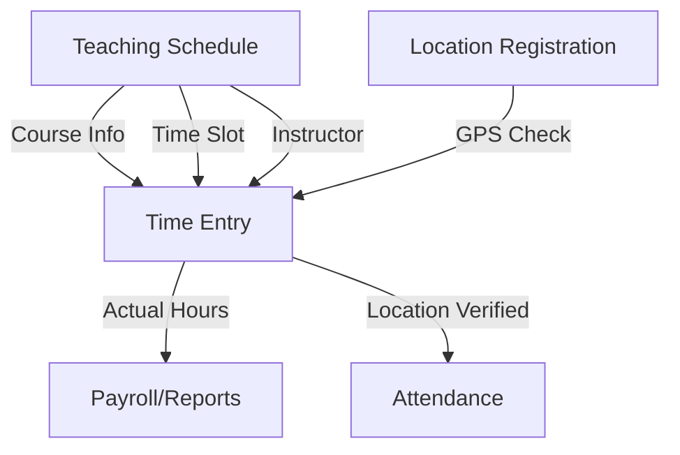

# Teaching Schedule & Time Tracking Integration Plan

## 🏗️ System Architecture Overview

### Current Systems

1. **Teaching Schedule System**
   - Tables: `teaching_courses`, `weekly_schedules`
   - Features: Drag-and-drop schedule management
   - Data: Course info, instructor assignments, time slots

2. **Time Tracking System**
   - Tables: `time_entries`, `user_registered_locations`
   - Features: GPS-based check-in/out, auto-registration
   - Data: Work hours, location verification, entry types

### Integration Points



## 🔗 Integration Strategy

### Phase 1: Data Linkage (Immediate)

1. **Add Teaching Schedule Reference to Time Entries**
   ```sql
   ALTER TABLE time_entries 
   ADD COLUMN IF NOT EXISTS weekly_schedule_id BIGINT REFERENCES weekly_schedules(id),
   ADD COLUMN IF NOT EXISTS teaching_course_id UUID REFERENCES teaching_courses(id);
   ```

2. **Enhance Check-In Process**
   - Auto-detect if instructor has scheduled class
   - Pre-fill course information
   - Validate check-in time against schedule

### Phase 2: Automated Check-In (Next Sprint)

1. **Schedule-Based Auto Check-In**
   ```javascript
   // When instructor checks in
   const scheduledClass = await getScheduledClassForNow(instructorId);
   if (scheduledClass) {
     checkInData.course_taught = scheduledClass.course_name;
     checkInData.entry_type = 'teaching';
     checkInData.weekly_schedule_id = scheduledClass.id;
   }
   ```

2. **Smart Validation**
   - Check if instructor is at correct location
   - Verify time matches schedule (±15 min grace)
   - Alert if no scheduled class but checking in as teaching

### Phase 3: Enhanced Reporting (Future)

1. **Teaching Hours Report**
   - Scheduled vs Actual hours
   - Location compliance
   - Student attendance correlation

2. **Automated Notifications**
   - Remind instructors 15 min before class
   - Alert if not checked in by class start
   - Weekly teaching hours summary

## 📝 Implementation Checklist

### Database Changes

```sql
-- 1. Add linking columns to time_entries
ALTER TABLE time_entries 
ADD COLUMN IF NOT EXISTS weekly_schedule_id BIGINT REFERENCES weekly_schedules(id),
ADD COLUMN IF NOT EXISTS teaching_course_id UUID REFERENCES teaching_courses(id),
ADD COLUMN IF NOT EXISTS scheduled_start_time TIME,
ADD COLUMN IF NOT EXISTS scheduled_end_time TIME,
ADD COLUMN IF NOT EXISTS schedule_variance_minutes INTEGER;

-- 2. Create indexes for performance
CREATE INDEX IF NOT EXISTS idx_time_entries_weekly_schedule 
ON time_entries(weekly_schedule_id);

CREATE INDEX IF NOT EXISTS idx_time_entries_teaching_course 
ON time_entries(teaching_course_id);

-- 3. Add computed column for schedule matching
ALTER TABLE time_entries
ADD COLUMN IF NOT EXISTS is_scheduled_teaching BOOLEAN 
GENERATED ALWAYS AS (weekly_schedule_id IS NOT NULL) STORED;
```

### Service Layer Updates

1. **timeTrackingService.js**
   ```javascript
   // Add function to check scheduled classes
   export const getScheduledClassForCheckIn = async (instructorId, checkInTime) => {
     const dayOfWeek = new Date(checkInTime).getDay();
     const timeSlot = new Date(checkInTime).toTimeString().slice(0, 5);
     
     // Query weekly_schedules for matching class
     const { data, error } = await supabase
       .from('weekly_schedules')
       .select(`
         *,
         course:teaching_courses(*)
       `)
       .eq('instructor_id', instructorId)
       .eq('day_of_week', dayOfWeek)
       .gte('start_time', addMinutes(timeSlot, -15))
       .lte('start_time', addMinutes(timeSlot, 15))
       .single();
       
     return { data, error };
   };
   ```

2. **teachingScheduleService.js**
   ```javascript
   // Add function to get teaching hours summary
   export const getTeachingHoursSummary = async (instructorId, startDate, endDate) => {
     // Join time_entries with weekly_schedules
     const { data, error } = await supabase
       .from('time_entries')
       .select(`
         *,
         schedule:weekly_schedules(*),
         course:teaching_courses(*)
       `)
       .eq('user_id', instructorId)
       .eq('entry_type', 'teaching')
       .gte('entry_date', startDate)
       .lte('entry_date', endDate);
       
     return { data, error };
   };
   ```

### UI Component Updates

1. **TimeClockWidget Enhancement**
   ```javascript
   // Check for scheduled class on mount
   useEffect(() => {
     if (user?.isInstructor) {
       checkForScheduledClass();
     }
   }, [user]);
   
   const checkForScheduledClass = async () => {
     const { data: scheduledClass } = await getScheduledClassForCheckIn(
       user.id, 
       new Date()
     );
     
     if (scheduledClass) {
       setScheduledClassInfo(scheduledClass);
       // Auto-fill form
       setSessionDetails({
         courseTaught: scheduledClass.course.name,
         scheduledTime: `${scheduledClass.start_time} - ${scheduledClass.end_time}`,
         location: scheduledClass.course.location
       });
     }
   };
   ```

2. **New Component: TeachingCheckInWidget**
   ```javascript
   // Specialized widget for instructor check-ins
   const TeachingCheckInWidget = () => {
     // Show scheduled classes for today
     // Allow quick check-in with pre-filled data
     // Show teaching hours summary
   };
   ```

## 🎯 Key Features After Integration

1. **Smart Check-In**
   - Auto-detect scheduled classes
   - Pre-fill course information
   - Validate location and time

2. **Teaching Analytics**
   - Scheduled vs Actual hours
   - Punctuality metrics
   - Location compliance rate

3. **Automated Workflows**
   - Check-in reminders
   - Absence notifications
   - Weekly reports

4. **Enhanced Validation**
   - Prevent check-in outside schedule
   - Require course selection for teaching
   - Cross-verify with student attendance

## 🚀 Quick Start Integration

### Step 1: Run Database Migration
```sql
\i sql_scripts/add-teaching-integration-columns.sql
```

### Step 2: Update Services
- Add schedule checking to timeTrackingService
- Create teaching summary functions
- Add validation rules

### Step 3: Update UI
- Enhance TimeClockWidget
- Add schedule info display
- Create teaching dashboard

### Step 4: Test Integration
- Check scheduled class detection
- Verify auto-fill functionality
- Test reporting accuracy

## 📊 Expected Benefits

1. **For Instructors**
   - Faster check-in process
   - Automatic course tracking
   - Clear schedule visibility

2. **For Administrators**
   - Accurate teaching hours
   - Schedule compliance tracking
   - Automated reporting

3. **For System**
   - Data consistency
   - Reduced manual entry
   - Better analytics

## 🔍 Monitoring Points

1. **Check-In Success Rate**
   - % of scheduled classes checked in
   - Average check-in time before class

2. **Data Quality**
   - % of entries with course info
   - Location verification rate

3. **User Adoption**
   - Instructors using smart check-in
   - Report generation frequency

---

Last Updated: August 2025
Integration Version: 1.0